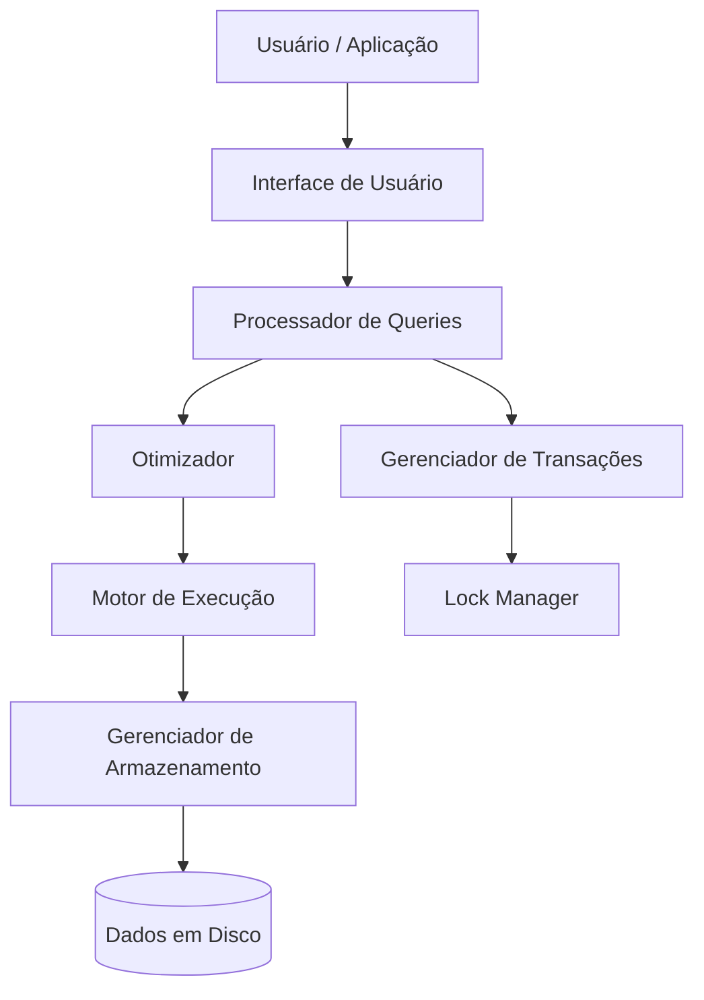
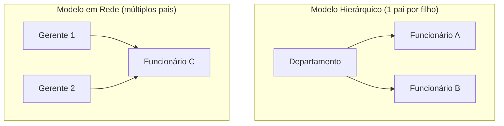
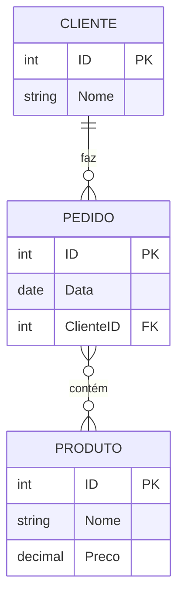
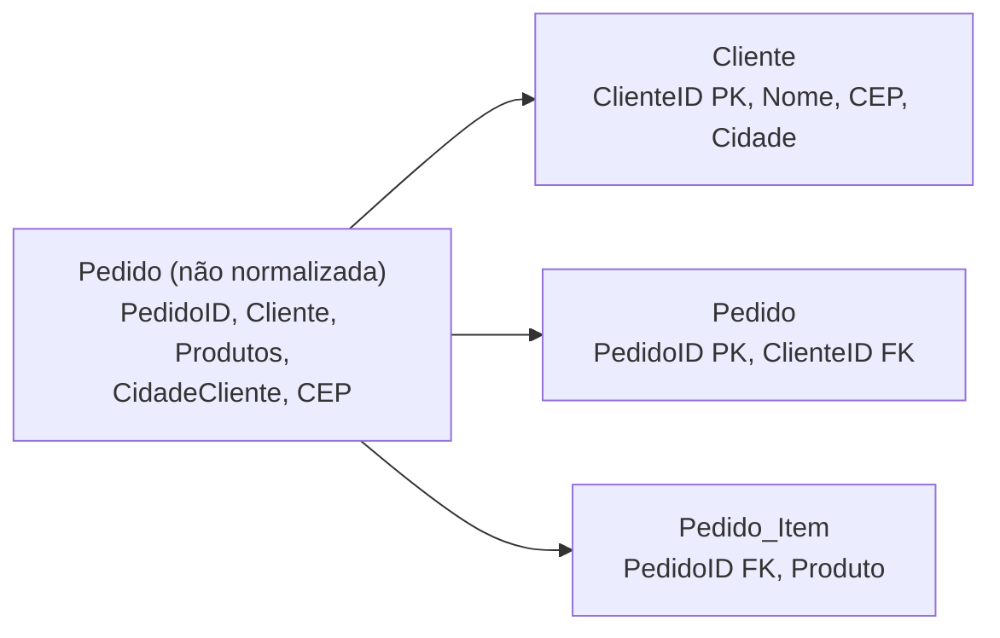
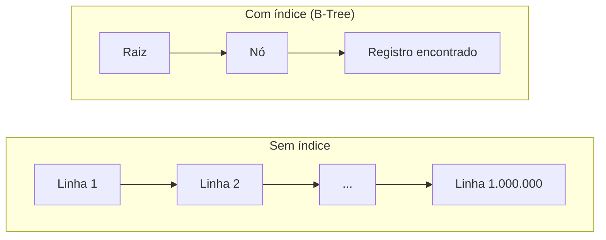
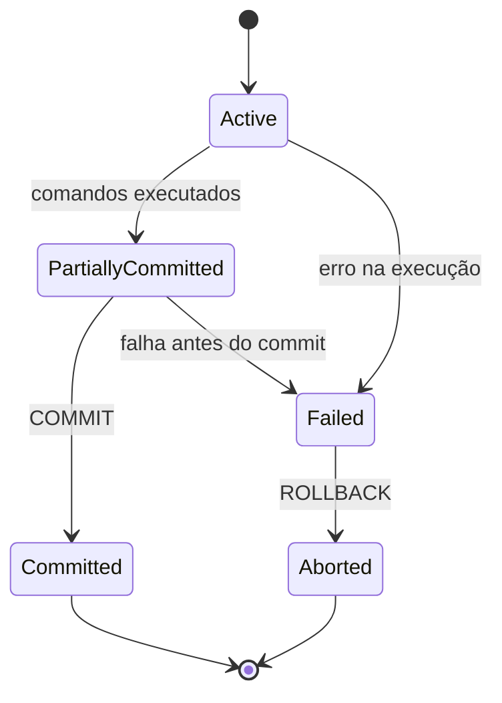
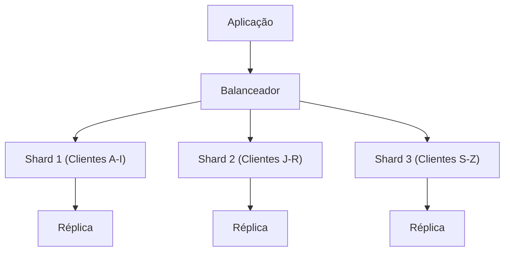

# Banco de dados

## Sumário

- [O Que É um Banco de Dados?](#o-que-é-um-banco-de-dados)
- [Sistemas de Gerenciamento de Bancos de Dados (DBMS)](#sistemas-de-gerenciamento-de-bancos-de-dados-dbms)
- [Modelos de Dados](#modelos-de-dados)
- [Tabelas: A Estrutura Básica de Armazenamento de Dados](#tabelas-a-estrutura-básica-de-armazenamento-de-dados)
- [Chaves Primárias (Primary Keys): Identificadores Únicos](#chaves-primárias-primary-keys-identificadores-únicos)
- [Chaves Estrangeiras (Foreign Keys): Conexões entre Tabelas](#chaves-estrangeiras-foreign-keys-conexões-entre-tabelas)
- [Bancos de Dados Relacionais vs. Não Relacionais](#bancos-de-dados-relacionais-vs-não-relacionais)
- [Linguagem SQL (Structured Query Language)](#linguagem-sql-structured-query-language)
- [Entidade-Relacionamento (ER Model)](#entidade-relacionamento-er-model)
- [Normalização](#normalização)
- [Índices: Aceleradores de Consultas](#índices-aceleradores-de-consultas)
- [Propriedades ACID](#propriedades-acid)
- [Transações](#transações)
- [Segurança em Bancos de Dados](#segurança-em-bancos-de-dados)
- [Big Data e Bancos Distribuídos](#big-data-e-bancos-distribuídos)
- [Backup e Recuperação](#backup-e-recuperação)
- [Como Tudo Se Conecta](#como-tudo-se-conecta)
- [Exemplos Completos](#exemplos-completos)

## O Que É um Banco de Dados?

Um banco de dados é, na sua essência, uma coleção organizada de dados que pode ser acessada, gerenciada e atualizada de forma eficiente. Para entender essa definição na prática, vale separar três elementos que sempre aparecem juntos. Primeiro, os dados propriamente ditos, que podem ser estruturados (números organizados em colunas de uma tabela), semi-estruturados (um arquivo XML ou JSON, que tem alguma organização mas não um esquema rígido) ou não estruturados (imagens e vídeos, que não seguem formato tabular algum). Em um banco relacional, esses dados moram em tabelas, onde cada linha é um registro — um cliente específico, por exemplo — e cada coluna é um atributo desse registro, como o nome, o e-mail ou a idade.

O segundo elemento são os metadados: "dados sobre dados". É o esquema que define o tipo de cada coluna (um inteiro, uma string, uma data), as restrições que ela deve obedecer (como "este campo nunca pode ficar vazio") e os índices que aceleram buscas futuras. Sem metadados, um banco seria apenas um amontoado de bytes sem significado — são eles que dizem ao sistema como interpretar o que está armazenado.

O terceiro elemento são os relacionamentos: a forma como diferentes conjuntos de dados se conectam entre si. Um cliente, por exemplo, pode estar relacionado a vários pedidos que já fez, e é justamente a capacidade de representar esse tipo de conexão de forma confiável que diferencia um banco de dados de uma simples pilha de arquivos de texto.

Historicamente, os bancos de dados evoluíram dos sistemas hierárquicos dos anos 1960 (como o IMS da IBM), passando pelo modelo em rede, até chegarem ao modelo relacional na década de 1970 — proposto por Edgar F. Codd, que teve a ideia de aplicar álgebra relacional, um ramo da matemática, para organizar e consultar dados. Essa mudança de paradigma é o motivo pelo qual, mais de cinquenta anos depois, ainda estudamos SQL: é a linguagem que nasceu diretamente dessa proposta.

Exemplos ajudam a enxergar a escala do conceito. No nível mais simples, a agenda de contatos do seu celular já é um banco de dados. No outro extremo, o Google mantém um banco com bilhões de páginas web indexadas e ainda assim devolve resultados de busca em milissegundos. No meio do caminho, um e-commerce como a Amazon usa o banco de dados para gerenciar inventário, avaliações de usuários e histórico de compras — tudo ao mesmo tempo, para milhões de usuários simultâneos.

As vantagens de organizar dados dessa forma são diretas: reduz-se a duplicação, evitando inconsistências como o mesmo endereço de cliente registrado de formas diferentes em dois lugares; múltiplos usuários e aplicações conseguem acessar os dados ao mesmo tempo sem conflito; regras de integridade podem ser impostas automaticamente, como impedir que uma idade negativa seja salva; e o sistema pode crescer de poucos megabytes até petabytes sem mudar de arquitetura. Isso não vem de graça: manter um banco tem custo de hardware e software, exige conhecimento especializado para desenhar esquemas e escrever consultas eficientes, e em volumes extremos pode sofrer gargalos de desempenho se não for bem otimizado.

Ainda assim, entender esse conceito básico é essencial porque bancos de dados são o backbone de praticamente todo sistema digital moderno, de aplicativos móveis à inteligência artificial. Sem eles, os dados seriam tão caóticos quanto uma biblioteca sem catálogo — existiriam, mas ninguém conseguiria encontrá-los.

## Sistemas de Gerenciamento de Bancos de Dados (DBMS)

Um SGBD (Sistema de Gerenciamento de Banco de Dados), ou DBMS na sigla em inglês, é o software que fica entre o usuário (ou uma aplicação) e os dados fisicamente armazenados em disco. Ele existe justamente para esconder essa complexidade: em vez de você precisar saber em qual bloco do disco um registro está gravado, você escreve um comando SQL e o SGBD cuida do resto. Uma boa analogia é pensar nele como o gerente de uma empresa — ele coordena, otimiza e protege o trabalho, mesmo que você nunca veja diretamente o que acontece nos bastidores.

Internamente, um SGBD é organizado em camadas. A mais visível é a interface de usuário, como uma ferramenta gráfica (phpMyAdmin, por exemplo). Abaixo dela fica o processador de queries, responsável por otimizar o SQL antes de executá-lo; o gerenciador de armazenamento, que lida com arquivos e buffers de memória; e o gerenciador de transações, que garante as propriedades ACID detalhadas mais adiante. Dentro dessas camadas ainda existem componentes especializados: o motor de execução roda o plano de query decidido pelo otimizador — que escolhe o caminho mais eficiente usando estatísticas sobre os dados —, e o lock manager controla o acesso concorrente para que duas transações não pisem uma na outra.



Existem diferentes famílias de SGBDs, cada uma otimizada para um tipo de carga de trabalho. Os RDBMS (bancos relacionais) seguem SQL e incluem nomes como MySQL (open-source, popular na web), PostgreSQL (mais avançado, com bom suporte a JSON), Oracle (robusto, voltado a grandes corporações) e SQL Server (da Microsoft, bem integrado ao ecossistema .NET). Os bancos NoSQL abrem mão de parte da rigidez do esquema relacional em troca de flexibilidade: o MongoDB guarda documentos, o Redis é um banco chave-valor extremamente rápido — ótimo para caches e sessões —, e o Neo4j é especializado em grafos, ideal para redes sociais e sistemas de recomendação. Existem ainda categorias mais recentes, como o NewSQL (o CockroachDB, por exemplo, tenta combinar a consistência do SQL com a escalabilidade horizontal do NoSQL) e os bancos in-memory, como o SAP HANA, que mantêm os dados na RAM para obter velocidade extrema.

Independentemente da família, todo SGBD cumpre um conjunto comum de funções: as operações básicas de CRUD (Create, Read, Update, Delete); o controle de concorrência, feito por locks — exclusivos ou compartilhados — ou por MVCC (Multi-Version Concurrency Control), uma técnica que permite que leitores vejam uma versão consistente dos dados enquanto escritores fazem alterações, sem que uns bloqueiem os outros e sem gerar "dirty reads" (leituras de dados que ainda não foram de fato confirmados); a recuperação de falhas, usando logs de transações para desfazer operações incompletas; e a segurança, com criptografia de dados em repouso e em trânsito, além de auditoria de acessos. Em um aplicativo bancário, por exemplo, é o SGBD que garante que uma transferência seja atômica mesmo que o sistema esteja processando milhares de outras transações no mesmo segundo.

A principal vantagem de usar um SGBD em vez de gerenciar arquivos manualmente é a automação: backups automáticos, replicação para alta disponibilidade e suporte a views (tabelas virtuais construídas a partir de consultas). O custo é o overhead que ele introduz — para sistemas muito simples, pode pesar mais do que ajudar — e as licenças de versões corporativas costumam ser caras. Ainda assim, é o SGBD que transforma dados brutos em informação utilizável, o que o torna uma peça essencial no dia a dia de desenvolvedores e administradores de sistemas.

## Modelos de Dados

Modelos de dados são abstrações que definem como os dados são representados, armazenados e manipulados — a "planta baixa" conceitual por trás de qualquer banco. Eles não surgiram todos de uma vez: cada modelo apareceu como resposta às limitações do anterior, então faz sentido percorrê-los na ordem em que evoluíram historicamente.

O modelo hierárquico organiza os dados como uma árvore, em que cada registro tem exatamente um "pai" e pode ter vários "filhos" — o sistema de arquivos do seu computador, com pastas e subpastas, é um exemplo perfeito. Sua vantagem é a navegação rápida quando a relação já é naturalmente hierárquica, mas ele sofre quando um registro precisa de mais de um pai: um funcionário que responde a dois gerentes, por exemplo, teria que ser duplicado. Esse modelo dominou os mainframes dos anos 1960 e caiu em desuso justamente por essa rigidez. O modelo em rede, baseado no padrão CODASYL, resolveu parte desse problema permitindo múltiplos pais e múltiplos filhos, formando uma rede em vez de uma árvore:



O ganho em flexibilidade veio com um custo: navegar pela rede exige seguir "ponteiros" manuais entre registros, o que torna o código de acesso aos dados complexo de escrever e de manter.

Foi só com o modelo relacional, proposto por Codd em 1970, que os ponteiros manuais desapareceram. Em vez disso, os dados passam a viver em tabelas — chamadas formalmente de relações —, com linhas (tuplas) e colunas (atributos), e as conexões entre tabelas são feitas por chaves primárias e estrangeiras, não por referências físicas de memória. É esse desacoplamento entre "como os dados se relacionam logicamente" e "onde eles estão fisicamente" que torna o modelo relacional tão mais simples de usar, e é o modelo detalhado no restante deste material.

Depois dele vieram variações voltadas a necessidades específicas. O modelo orientado a objetos (OODBMS) guarda os dados como objetos de uma linguagem de programação — com classes, herança e encapsulamento — evitando a etapa de "traduzir" um objeto em linhas de tabela; é usado principalmente em nichos como CAD e sistemas multimídia. O modelo de documentos armazena cada registro como um documento autocontido em JSON ou BSON, como `{ "nome": "João", "enderecos": ["Rua A, 123", "Av. B, 456"] }`, o que dá um schema flexível — documentos da mesma coleção podem ter campos diferentes — em troca de joins mais difíceis entre documentos. Existem ainda o modelo colunar, otimizado para leituras analíticas (como o BigQuery), e o modelo de grafos, em que nós e arestas representam diretamente as relações — a base do grafo social do Facebook, por exemplo.

A tabela abaixo resume o comparativo:

| Modelo       | Estrutura Principal | Exemplo de Uso          | Força Principal     |
|--------------|---------------------|-------------------------|---------------------|
| Hierárquico | Árvore             | Sistemas de arquivos   | Hierarquias simples |
| Relacional  | Tabelas            | Bancos transacionais   | Consistência       |
| Documentos  | JSON-like          | Apps web dinâmicos     | Flexibilidade      |

Qual modelo escolher depende dos requisitos da aplicação: um sistema transacional, como um ERP, tende a se beneficiar da consistência do modelo relacional, enquanto um catálogo de produtos com atributos muito variáveis pode se sair melhor com documentos. Essa escolha impacta diretamente a performance e a manutenção no longo prazo.

**Exercícios de fixação:**

1. Explique a diferença entre o modelo hierárquico e o modelo em rede, citando um exemplo de cada.
2. Por que o modelo relacional se tornou dominante em vez do hierárquico ou em rede?
3. Em qual cenário um modelo de documentos (JSON) seria mais adequado que um modelo relacional?

## Tabelas: A Estrutura Básica de Armazenamento de Dados

As tabelas são o coração de um banco de dados relacional: uma coleção organizada de dados em formato de grade, parecida com uma planilha, mas com regras rígidas que garantem consistência e integridade. Formalmente, uma tabela é uma relação matemática composta por linhas (tuplas, ou registros) e colunas (atributos, ou campos), e cada tabela representa uma entidade específica do mundo real — "Clientes" ou "Produtos", por exemplo.

Cada coluna é definida por um nome, um tipo de dado (`INT` para inteiros, `VARCHAR` para textos de tamanho variável, `DATE` para datas) e, opcionalmente, por constraints — restrições como `NOT NULL`, que obriga o preenchimento, ou `DEFAULT`, que define um valor padrão quando nada é informado. Cada linha representa uma instância única daquela entidade: na tabela "Clientes", por exemplo, uma linha poderia ser `ID=1, Nome="João Silva", Idade=30`. O conjunto dessas definições — colunas, tipos e constraints — é o esquema da tabela, criado através de comandos DDL (Data Definition Language) em SQL. Além das restrições por coluna, ainda existem constraints que valem para a tabela inteira, como `UNIQUE` (nenhum valor pode se repetir) e `CHECK` (uma condição personalizada, como "a idade deve ser maior que 18").

Na prática, criar e usar uma tabela passa por um pequeno ciclo de comandos:

```sql
CREATE TABLE Clientes (ID INT NOT NULL, Nome VARCHAR(100), Idade INT CHECK (Idade >= 0));
INSERT INTO Clientes (ID, Nome, Idade) VALUES (1, 'João Silva', 30);
SELECT * FROM Clientes WHERE Idade > 25;
ALTER TABLE Clientes ADD COLUMN Email VARCHAR(50);
DROP TABLE Clientes; -- cuidado, isso remove tudo!
```

Uma boa analogia é pensar numa tabela como uma ficha de cadastro de biblioteca: cada coluna é um campo (Nome do Livro, Autor, Ano) e cada linha é um livro específico. Em um e-commerce real, a tabela "Produtos" teria colunas como `ID_Produto`, `Nome`, `Preco` e `Estoque`, o que já permite consultas como "todos os produtos com preço abaixo de R$100".

A grande vantagem das tabelas é permitir modelar entidades do mundo real de forma organizada, reduzindo redundância quando combinadas com normalização — evitando, por exemplo, repetir o endereço de um cliente em cada um dos seus pedidos —, além de serem otimizadas para operações de CRUD e terem integridade garantida pelos constraints. O lado inverso dessa rigidez é que alterar uma tabela em produção, mudando o tipo de uma coluna por exemplo, pode exigir uma migração cuidadosa para não perder dados; tabelas muito largas (muitas colunas) ou muito altas (milhões de linhas) podem precisar de particionamento ou sharding; e dados não estruturados, como imagens grandes, simplesmente não cabem bem numa tabela — nesses casos, usam-se blobs ou arquivos externos.

Sem tabelas, os dados de um sistema seriam uma sopa desorganizada, e nenhuma das ferramentas que veremos a seguir — chaves, índices, SQL — teria como existir. Elas são a unidade mínima de armazenamento lógico e a base de tudo o que vem depois.

**Exercícios de fixação:**

1. Escreva o comando `CREATE TABLE` para uma tabela `Livros` com as colunas: `ID` (chave primária, auto incremento), `Titulo` (texto de até 150 caracteres, obrigatório), `Ano` (inteiro) e `Preco` (decimal com 2 casas, deve ser maior que 0).

   <details><summary>Ver resposta</summary>

   ```sql
   CREATE TABLE Livros (
     ID INT AUTO_INCREMENT PRIMARY KEY,
     Titulo VARCHAR(150) NOT NULL,
     Ano INT,
     Preco DECIMAL(10,2) CHECK (Preco > 0)
   );
   ```

   </details>

2. O que acontece se você tentar inserir uma linha na tabela acima sem informar o campo `Titulo`? Por quê?

## Chaves Primárias (Primary Keys): Identificadores Únicos

Uma chave primária (PK) é o atributo — ou conjunto de atributos — que identifica unicamente cada registro de uma tabela. Ela nunca pode se repetir nem ficar vazia (`NULL`), e é justamente essa garantia que a torna a referência segura para os relacionamentos entre tabelas vistos na próxima seção. Toda tabela bem projetada deve ter uma PK, que o próprio banco já indexa automaticamente — o motivo disso fica mais claro na seção sobre [Índices](#índices-aceleradores-de-consultas).

Existem algumas formas comuns de definir uma PK: um `INT AUTO_INCREMENT`, gerado automaticamente pelo banco a cada novo registro; um `UUID`, útil quando os dados são gerados em múltiplos servidores distribuídos e não podem depender de uma sequência central; ou uma chave composta, formada por mais de uma coluna, como `Codigo_Pais + Codigo_Cidade`. Uma regra prática importante na hora de escolher: prefira valores artificiais — as chamadas *surrogate keys*, como um ID sequencial — em vez de valores "naturais" como o CPF, já que um dado natural pode mudar, ter exceções ou, em alguns casos, nem existir, o que complica a PK no longo prazo.

```sql
CREATE TABLE Clientes (ID INT PRIMARY KEY AUTO_INCREMENT, Nome VARCHAR(100));
CREATE TABLE Pedidos_Itens (Pedido_ID INT, Produto_ID INT, PRIMARY KEY (Pedido_ID, Produto_ID));
SELECT * FROM Clientes WHERE ID = 1;
```

Pense na PK como o número de matrícula de um aluno numa universidade: único para cada pessoa, usado depois para acessar notas e histórico sem risco de confundir duas pessoas com o mesmo nome. Numa tabela "Funcionarios" real, é a PK `ID_Funcionario` que garante que dois "João Silva" diferentes nunca sejam tratados como a mesma pessoa.

As vantagens são diretas: elimina ambiguidade, serve de base para chaves estrangeiras, ganha um índice automaticamente e, quando bem escolhida, é eficiente em armazenamento. Os cuidados também existem: PKs compostas podem deixar inserts mais lentos por causa das verificações extras de unicidade, escolher um dado sensível (como e-mail) como PK complica mudanças futuras, e em bancos distribuídos IDs sequenciais podem criar "pontos quentes" de escrita, algo que costuma ser resolvido com UUIDs. Sem uma PK, uma tabela seria como uma lista sem números de identificação — impossível referenciar um item específico de forma confiável, o que abre espaço para duplicação e inconsistência.

**Exercícios de fixação:**

1. Por que geralmente é melhor usar uma chave artificial (surrogate, ex.: ID) em vez do CPF como chave primária de uma tabela de Clientes?
2. Dê um exemplo de chave primária composta e explique em que situação ela é necessária.

## Chaves Estrangeiras (Foreign Keys): Conexões entre Tabelas

Uma chave estrangeira (FK) é um atributo de uma tabela que aponta para a PK de outra tabela, estabelecendo um relacionamento entre elas. O papel da FK é garantir que todo valor gravado ali já exista como PK na tabela referenciada — isso evita "órfãos" (registros que apontam para um pai inexistente) e é o mecanismo por trás dos relacionamentos 1:N (um cliente com vários pedidos) e N:N (alunos e cursos, através de uma tabela de matrículas intermediária).

Além de simplesmente referenciar, uma FK pode definir o que acontece quando o registro pai é alterado ou apagado: `ON DELETE CASCADE` apaga os filhos automaticamente junto com o pai, enquanto `ON UPDATE RESTRICT` impede uma atualização que quebraria a referência. Os relacionamentos modelados por FK seguem três padrões — 1:1 (raro, como um perfil de usuário), 1:N (o mais comum) e N:N, que na prática nunca é implementado diretamente: sempre passa por uma tabela intermediária com duas FKs.

```sql
CREATE TABLE Pedidos (ID INT PRIMARY KEY, Cliente_ID INT, FOREIGN KEY (Cliente_ID) REFERENCES Clientes(ID) ON DELETE CASCADE);
INSERT INTO Pedidos (ID, Cliente_ID) VALUES (101, 1); -- falha se Cliente_ID=1 não existir
SELECT Clientes.Nome, Pedidos.ID FROM Clientes INNER JOIN Pedidos ON Clientes.ID = Pedidos.Cliente_ID;
```

Uma boa analogia: pense num endereço que referencia uma cidade — o CEP precisa existir na tabela de cidades, ou o endereço é inválido. Num banco de hospital, é a FK em "Consultas" apontando para `Pacientes.ID` que garante que nenhuma consulta fique associada a um paciente inexistente.

As FKs previnem dados inconsistentes, permitem modelar o mundo real de forma relacional, automatizam parte da manutenção via cascatas e viabilizam consultas ricas através de joins. Em compensação, verificações de FK em inserts e updates têm um custo de performance — em cargas em massa, às vezes vale a pena desativá-las temporariamente — e é preciso cuidado com ciclos de referência (A referencia B, que referencia A de volta), que complicam exclusões. Em bancos NoSQL, as FKs simplesmente não existem como recurso nativo; a integridade referencial, quando necessária, precisa ser controlada manualmente pela aplicação. No fim, são as FKs que transformam um conjunto de tabelas isoladas em um sistema de fato interconectado.

**Exercícios de fixação:**

1. Escreva o SQL para criar uma tabela `Matriculas` que referencia `Alunos.ID` e `Cursos.ID`, apagando as matrículas automaticamente quando o aluno for removido.
2. O que é um registro "órfão" e como a FK evita isso?

## Bancos de Dados Relacionais vs. Não Relacionais

A escolha entre um banco relacional e um NoSQL se tornou uma decisão de arquitetura central na era do big data, e entender o trade-off por trás dela evita escolher a ferramenta errada por modismo.

Bancos relacionais (SQL) têm esquema fixo, seguem as propriedades ACID — detalhadas mais adiante — e suportam consultas complexas com joins, subqueries e agregações como `SUM` e `AVG`. Internamente, costumam armazenar os dados por linha (row-based), o que favorece transações, e dependem de normalização para manter a integridade. MySQL por trás do WordPress e PostgreSQL com suporte a dados geográficos são exemplos típicos. A força desse modelo é a consistência forte, a maturidade das ferramentas de BI e o tempo de mercado; a fraqueza é que escalar verticalmente — colocar mais hardware numa única máquina — tem um teto, e mudanças de esquema em produção tendem a ser disruptivas.

Bancos NoSQL abrem mão de parte dessa rigidez em troca de escala horizontal. Em vez de ACID, seguem o modelo BASE (*Basically Available, Soft state, Eventual consistency*): o sistema prioriza estar sempre disponível e aceita que, por um curto período, réplicas diferentes mostrem valores levemente desatualizados até se sincronizarem. Um exemplo simples torna isso concreto: ao curtir uma foto no Instagram, o contador de curtidas pode demorar um instante para atualizar em todos os servidores — isso é consistência eventual, perfeitamente aceitável nesse caso, o que não seria verdade para o saldo de uma conta bancária. Dentro do universo NoSQL existem várias famílias: chave-valor, simples como um dicionário (Redis, para sessões de usuário); documentos, para dados aninhados (MongoDB, para logs); colunares, otimizados para leituras analíticas (Cassandra, para séries temporais); e grafos, voltados a travessias (Neo4j, para detecção de fraude). O DynamoDB da AWS é um exemplo de banco NoSQL pensado para escalar horizontalmente sem intervenção manual.

|  | Relacional (SQL) | Não Relacional (NoSQL) |
|---|---|---|
| Esquema | Fixo | Flexível |
| Consistência | ACID | BASE (eventual) |
| Escala | Vertical | Horizontal |
| Bom para | Finanças, sistemas transacionais | IoT, alto volume, dados variáveis |

Na prática, muitos sistemas modernos combinam os dois — um padrão chamado *polyglot persistence* — usando o banco relacional para o núcleo transacional (pagamentos, cadastro) e um NoSQL para o que precisa de escala elástica (sessões, eventos, logs).

## Linguagem SQL (Structured Query Language)

SQL — Structured Query Language, ou Linguagem de Consulta Estruturada — é a linguagem padrão para gerenciar e manipular bancos de dados relacionais. Pronuncia-se "sequel" ou soletrando "S-Q-L", e foi criada na década de 1970 diretamente a partir do modelo relacional proposto por Codd; desde então, tornou-se indispensável para qualquer sistema que precise armazenar, consultar e modificar dados organizados em tabelas.

A característica que mais define o SQL é ser uma linguagem declarativa: você descreve o que quer obter ou modificar, sem precisar especificar como o banco deve fazer isso internamente. Na prática, você escreve o comando e o SGBD — MySQL, PostgreSQL, Oracle, SQL Server, entre outros — decide o plano de execução, acessa os dados fisicamente armazenados, executa a operação e devolve o resultado. Quando você escreve "selecionar clientes maiores de 30 anos", é o otimizador do banco quem decide se vale mais a pena usar um índice ou varrer a tabela inteira — você não precisa saber disso para obter a resposta certa.

Os comandos SQL se agrupam em cinco categorias, cada uma com uma responsabilidade distinta:

| Categoria | Função | Exemplos |
|---|---|---|
| [DDL](/NBD/ddl.md) — Data Definition Language | Cria e altera a estrutura de bancos, tabelas e índices | `CREATE`, `ALTER`, `DROP` |
| [DML](/NBD/dml.md) — Data Manipulation Language | Manipula os dados armazenados | `INSERT`, `UPDATE`, `DELETE` |
| [DQL](/NBD/dql.md) — Data Query Language | Consulta dados | `SELECT` |
| DCL — Data Control Language | Controla permissões e acessos | `GRANT`, `REVOKE` |
| TCL — Transaction Control Language | Controla transações | `COMMIT`, `ROLLBACK` |

Praticamente todo SGBD relacional implementa esse núcleo comum — MySQL, PostgreSQL, SQL Server, Oracle, MariaDB, SQLite e outros —, ainda que cada um adicione extensões próprias por cima do padrão. É justamente essa portabilidade que faz do SQL a linguagem universal para lidar com dados estruturados, e por isso seu domínio é essencial para desenvolvedores, analistas e administradores de banco de dados: é o que transforma dados brutos em informação útil para decisão.

**Exercícios de fixação:**

1. Classifique cada comando como DDL, DML ou DQL: `ALTER TABLE`, `INSERT INTO`, `SELECT`, `DROP TABLE`, `UPDATE`.

   <details><summary>Ver resposta</summary>

   DDL: `ALTER TABLE`, `DROP TABLE` — DML: `INSERT INTO`, `UPDATE` — DQL: `SELECT`

   </details>

2. Veja os exemplos completos de [DDL](/NBD/ddl.md), [DML](/NBD/dml.md) e [DQL](/NBD/dql.md) e execute pelo menos uma consulta de cada tipo em um banco de testes.

## Entidade-Relacionamento (ER Model)

Desenvolvido por Peter Chen em 1976, o modelo Entidade-Relacionamento (ER Model) é uma ferramenta de modelagem conceitual: antes de escrever qualquer `CREATE TABLE`, ele ajuda a pensar em quais "coisas" existem no sistema (entidades), quais informações elas guardam (atributos) e como se conectam (relacionamentos) — tudo isso ainda em diagrama, longe dos detalhes de implementação.

As entidades podem ser fortes, quando existem de forma independente (um Cliente existe por si só), ou fracas, quando dependem de outra entidade para fazer sentido (um Item de Pedido não existe sem um Pedido). Os atributos podem ser simples (um valor atômico, como um nome), compostos (agregam vários valores, como um Endereço feito de Rua + Cidade), multivalorados (podem ter mais de um valor, como uma lista de Telefones) ou derivados (calculados a partir de outro atributo, como a Idade calculada a partir da Data de Nascimento). Já os relacionamentos carregam uma cardinalidade — 1:1, 1:N ou N:N — e uma participação, que pode ser total (toda instância da entidade precisa participar do relacionamento) ou parcial.

O diagrama abaixo modela um pequeno sistema de pedidos: um Cliente faz vários Pedidos (1:N), e cada Pedido contém vários Produtos, enquanto cada Produto pode aparecer em vários pedidos (N:N):



A conversão desse diagrama para o modelo relacional segue uma regra simples: entidades viram tabelas, atributos viram colunas e relacionamentos viram chaves estrangeiras (no caso 1:N) ou uma tabela de junção (no caso N:N). Aplicando isso à parte 1:N do diagrama acima:

```sql
CREATE TABLE Cliente (
  ID INT AUTO_INCREMENT PRIMARY KEY,
  Nome VARCHAR(100) NOT NULL
);

CREATE TABLE Pedido (
  ID INT AUTO_INCREMENT PRIMARY KEY,
  Data DATE NOT NULL,
  ClienteID INT NOT NULL,
  FOREIGN KEY (ClienteID) REFERENCES Cliente(ID)
);
```

Note como o "1:N" do diagrama se traduz exatamente na `FOREIGN KEY (ClienteID)` dentro de `Pedido` — o mesmo padrão já visto na seção de [Chaves Estrangeiras](#chaves-estrangeiras-foreign-keys-conexões-entre-tabelas). Ferramentas como Lucidchart ou ERDPlus ajudam a desenhar esses diagramas antes de implementá-los, e o investimento vale a pena: um ER Model bem-feito previne erros de design que só apareceriam tarde demais, depois que o banco já está em produção, além de facilitar a comunicação entre quem projeta o sistema e quem vai usá-lo.

**Exercícios de fixação:**

1. Modele um mini sistema de "Biblioteca" com as entidades Livro, Autor e Empréstimo. Quais são as cardinalidades entre elas?
2. Como um relacionamento N:N entre Aluno e Curso é representado quando convertido para o modelo relacional?

## Normalização

Normalização é o processo de organizar as tabelas de um banco para eliminar redundância e evitar anomalias de inserção, atualização e exclusão — problemas que surgem quando a mesma informação está repetida em vários lugares e alguém atualiza um lugar mas esquece o outro.

O processo é dividido em "formas normais", cada uma mais rigorosa que a anterior. A primeira forma normal (1NF) exige que todo valor seja atômico, sem grupos repetidos dentro de uma célula — uma coluna com "Hobbies: ler, nadar" viola a 1NF e precisa virar uma linha por hobby. A segunda forma normal (2NF) parte da 1NF e elimina dependências parciais: em uma tabela com chave composta, todo atributo precisa depender da chave completa, não de só uma parte dela. A terceira forma normal (3NF) vai além e elimina dependências transitivas — uma coluna "Cidade" que na verdade depende do "CEP", que por sua vez depende do cliente e não diretamente do pedido, é uma dependência transitiva que precisa ser removida. Formas ainda mais rigorosas existem — a BCNF, exigindo que toda dependência funcional parta de uma superchave, e a 4NF/5NF, voltadas a atributos multivalorados e joins complexos —, mas na prática do dia a dia, chegar até a 3NF já resolve a grande maioria dos problemas de redundância.

Para ver isso em ação, considere esta tabela não normalizada:

| PedidoID | Cliente | Produtos | CidadeCliente | CEP |
|---|---|---|---|---|
| 1 | João | Caneta, Caderno | São Paulo | 01000 |

Aplicando 1NF, separamos "Produtos" em uma linha por produto, criando uma tabela própria `Pedido_Item(PedidoID, Produto)`. Aplicando 2NF, se a chave fosse composta (`PedidoID + Produto`) e "Cliente" dependesse só de `PedidoID` — não do par inteiro —, movemos "Cliente" para sua própria tabela: `Pedido(PedidoID, ClienteID)`. Por fim, aplicando 3NF, percebemos que "CidadeCliente" depende do "CEP", que por sua vez depende do cliente, não do pedido — ou seja, a cidade depende de `PedidoID` só indiretamente, através do CEP. Isso nos leva a criar `Cliente(ClienteID, Nome, CEP, Cidade)`.



O resultado são três tabelas menores, ligadas por chaves estrangeiras, em que "São Paulo" não precisa mais ser repetido a cada pedido do mesmo cliente. É importante notar que normalizar não é um objetivo em si — é um meio de garantir consistência e economizar espaço. Em cenários onde a performance de leitura é mais crítica do que o espaço em disco, é comum aplicar o processo inverso, a denormalização, reintroduzindo alguma redundância de propósito, como guardar um total já calculado em vez de recalculá-lo a cada consulta.

**Exercícios de fixação:**

1. Dada uma tabela `Pedido(ID, Cliente, Produto1, Produto2, Produto3)`, explique por que ela viola a 1NF e como corrigi-la.
2. Dê um exemplo de dependência transitiva que viola a 3NF.

## Índices: Aceleradores de Consultas

Um índice é uma estrutura de dados auxiliar que acelera a recuperação de informações, de forma parecida com o índice remissivo no final de um livro: em vez de ler o livro inteiro à procura de um termo, você consulta o índice e vai direto à página certa. Sem um índice, o SGBD precisa fazer uma varredura completa da tabela (*full table scan*) para responder uma consulta; com um índice bem escolhido, ele localiza o registro em poucos passos.



Internamente, os índices mais comuns usam uma estrutura chamada B-Tree, ideal para buscas por intervalo (`>`, `<`, `BETWEEN`); estruturas de hash, mais rápidas para buscas de igualdade exata; e bitmaps, eficientes em colunas de baixa cardinalidade, como um campo de gênero com só dois valores possíveis. Quanto ao tipo, o índice primário é criado automaticamente sobre a chave primária e costuma ser clusterizado — ou seja, ordena fisicamente os dados no disco —, enquanto índices secundários (não únicos, non-clusterizados) apenas apontam para onde o dado está. Também existem índices únicos ou compostos (sobre várias colunas ao mesmo tempo) e índices full-text, voltados a buscas textuais como `LIKE '%termo%'`.

Criar, usar e remover índices em SQL é direto:

```sql
CREATE INDEX idx_nome ON Clientes(Nome);
CREATE UNIQUE INDEX idx_email ON Clientes(Email);
CREATE INDEX idx_composto ON Pedidos(Cliente_ID, Data);
EXPLAIN SELECT * FROM Clientes WHERE Nome = 'João'; -- mostra se o índice é usado
DROP INDEX idx_nome ON Clientes;
```

O ganho é real: numa tabela de logs com milhões de entradas, um índice sobre "Data" transforma uma consulta como `SELECT ... WHERE Data BETWEEN '2024-01-01' AND '2024-12-31'` de uma operação lenta em algo quase instantâneo, reduzindo o tempo de busca de O(n) para O(log n). Índices também aceleram `ORDER BY` e `GROUP BY`, garantem unicidade além da PK, e um índice "covering" — que já contém todas as colunas pedidas pela consulta — evita até o acesso à tabela original.

Esse ganho, no entanto, não é de graça. Cada índice precisa ser reescrito a cada `INSERT`, `UPDATE` ou `DELETE`, o que consome I/O e pode dobrar o espaço ocupado pelo banco; por isso, criar um índice em cada coluna "por garantia" tende a piorar o desempenho de escrita sem trazer benefício real. A boa prática é indexar apenas colunas de alta seletividade (com muitos valores distintos) que aparecem com frequência em `WHERE`, `JOIN` ou `ORDER BY` — e sempre confirmar isso analisando consultas reais com `EXPLAIN`, em vez de indexar por intuição.

**Exercícios de fixação:**

1. Por que criar um índice em toda coluna de uma tabela pode ser uma má ideia?
2. Em qual situação um índice Full-Text seria mais útil que um índice B-Tree comum?

## Propriedades ACID

Propriedades ACID garantem a confiabilidade de uma transação — um bloco de comandos SQL que deve ser tratado como uma unidade indivisível. O nome é um acrônimo de quatro garantias. Atomicidade significa que a transação é "tudo ou nada": se qualquer comando falhar no meio do caminho, o banco desfaz (rollback) tudo o que já havia sido feito, usando os logs de transação para isso. Consistência garante que, antes e depois da transação, os dados respeitem todas as regras do banco — constraints, chaves, triggers —, de modo que uma transação nunca deixe os dados num estado inválido. Isolamento assegura que transações executando ao mesmo tempo não enxerguem resultados parciais umas das outras; níveis de isolamento como Read Committed controlam o quanto uma transação pode ver do trabalho ainda não confirmado de outra, evitando os chamados *phantom reads* — quando a mesma consulta, repetida dentro de uma transação, retorna linhas diferentes porque outra transação inseriu dados no meio do caminho. Por fim, Durabilidade garante que, depois de um `COMMIT`, a mudança sobrevive mesmo a uma queda de energia — algo obtido através do Write-Ahead Logging (WAL), que grava a mudança em um log em disco antes mesmo de confirmar a transação.

Uma transferência bancária de R$100 entre duas contas ilustra bem essas quatro garantias trabalhando juntas:

```sql
START TRANSACTION;
UPDATE Contas SET Saldo = Saldo - 100 WHERE ID = 'A';
UPDATE Contas SET Saldo = Saldo + 100 WHERE ID = 'B';
COMMIT;
```

Se o servidor cair depois do primeiro `UPDATE` mas antes do `COMMIT`, a atomicidade garante que o débito seja desfeito automaticamente assim que o banco reiniciar — a conta A nunca fica debitada sem que a conta B tenha recebido o valor correspondente. É por essa razão que ACID é indispensável em sistemas críticos como os bancários, onde perder ou duplicar uma transação tem custo financeiro real.

**Exercícios de fixação:**

1. Dê um exemplo (diferente da transferência bancária do texto) do que aconteceria se a propriedade de Atomicidade não existisse.
2. Qual a diferença prática entre Isolamento e Consistência?

## Transações

Uma transação é uma unidade lógica de trabalho: um conjunto de comandos SQL que só faz sentido se executado por completo, exatamente pelas garantias ACID discutidas acima. Ao longo de sua execução, ela passa por uma série de estados — começa Active enquanto os comandos rodam, passa por Partially Committed quando todos já terminaram mas a confirmação ainda não foi efetivada, e chega a Committed quando a mudança já é definitiva e durável. Se algo dá errado no meio do caminho, ela vai para Failed e depois Aborted, uma vez que o rollback é aplicado.



Nem sempre é preciso desfazer a transação inteira: um `SAVEPOINT` permite marcar um ponto intermediário e voltar só até ali, preservando o que veio antes:

```sql
START TRANSACTION;
UPDATE Estoque SET Quantidade = Quantidade - 1 WHERE Produto = 'Caneta';
SAVEPOINT depois_estoque;
UPDATE Contas SET Saldo = Saldo - 5 WHERE Cliente = 'João';
-- Se o pagamento falhar, desfaz só o pagamento e mantém a baixa no estoque:
ROLLBACK TO depois_estoque;
COMMIT;
```

A concorrência entre transações traz problemas que vale entender de forma concreta. Imagine duas pessoas comprando o último item de um estoque exatamente ao mesmo tempo: se ambas leem "Quantidade = 1" antes de qualquer uma escrever, as duas transações podem decrementar o valor para 0 de forma independente — e o sistema acaba deixando passar duas vendas de um item que só existia um, um problema chamado *lost update*. O SGBD evita isso com locks (uma transação bloqueia a linha até terminar) ou com MVCC, a técnica já mencionada na seção sobre [DBMS](#sistemas-de-gerenciamento-de-bancos-de-dados-dbms). Quando uma transação envolve mais de um banco de dados — debitar em um servidor e creditar em outro, por exemplo —, entra em cena o protocolo 2PC (Two-Phase Commit): primeiro todos os bancos envolvidos confirmam que conseguem aplicar a mudança (fase de preparação); só depois, se todos concordarem, a mudança é efetivada em todos ao mesmo tempo (fase de commit). É esse conjunto de mecanismos que mantém a integridade dos dados mesmo em ambientes com múltiplos usuários e processos simultâneos.

## Segurança em Bancos de Dados

Um banco de dados precisa se proteger tanto de ameaças externas quanto de uso indevido interno, e isso passa por várias camadas de defesa trabalhando juntas. A autenticação garante que só quem deveria ter acesso consiga entrar, seja por senha, autenticação multifator (MFA) ou certificados digitais. A autorização, uma vez autenticado o usuário, decide o que cada um pode fazer — e a abordagem mais comum para isso é o RBAC (Role-Based Access Control): em vez de conceder permissões usuário por usuário, cria-se papéis, como "vendedor" ou "gerente", cada um com um conjunto fixo de permissões, e os usuários são simplesmente atribuídos a esses papéis. A criptografia protege os dados tanto em repouso (com AES, por exemplo) quanto em trânsito (com TLS), e a auditoria mantém logs de queries executadas, essenciais para investigar incidentes e atender exigências de compliance.

Uma das ameaças mais conhecidas é o SQL Injection, em que um atacante insere código SQL malicioso dentro de um campo de entrada esperando que ele seja executado pelo banco. A defesa padrão é usar queries parametrizadas em vez de concatenar strings diretamente na consulta:

```sql
PREPARE stmt FROM 'SELECT * FROM Users WHERE ID = ?';
```

Aqui, o valor recebido do usuário é tratado sempre como um dado, nunca como parte do comando SQL — mesmo que alguém digite algo como `1 OR 1=1`, o banco não interpreta isso como uma condição lógica adicional. Outras defesas incluem firewalls contra ataques de negação de serviço (DDoS). Com leis como a LGPD no Brasil e o GDPR na Europa, uma violação de segurança deixou de ser apenas um problema técnico — pode custar milhões em multas e danos à reputação da empresa.

**Exercícios de fixação:**

1. Por que usar uma query parametrizada (como `PREPARE stmt FROM 'SELECT * FROM Users WHERE ID = ?'`) previne SQL Injection, enquanto concatenar strings diretamente na query não?
2. O que é RBAC e por que é preferível a dar acesso de administrador para todos os usuários?

## Big Data e Bancos Distribuídos

Big Data é o nome dado a volumes de dados grandes — ou rápidos — demais para um único servidor tradicional processar sozinho, geralmente resumidos nos "3Vs": Volume (a quantidade em si), Variedade (formatos diferentes, de texto a vídeo) e Velocidade (dados chegando continuamente, em tempo real).

Um conjunto de tecnologias surgiu especificamente para lidar com essa escala. O Hadoop resolve o problema em duas frentes: o HDFS distribui o armazenamento, dividindo o dado e espalhando-o por vários servidores, enquanto o MapReduce distribui o processamento, quebrando um cálculo grande em tarefas menores que rodam em paralelo e depois são combinadas num resultado final. O Spark faz algo parecido, mas processa em memória em vez de gravar resultados intermediários em disco a cada etapa, o que o torna muito mais rápido em cálculos iterativos. Já o Kafka funciona como uma fila de mensagens de altíssimo volume, usada para capturar eventos em tempo real — cada clique num site, por exemplo — antes de eles serem efetivamente processados.

Para escalar o armazenamento em si, duas técnicas se destacam: o sharding, que divide uma tabela grande em pedaços menores ("shards") distribuídos entre servidores diferentes, de modo que nenhum precise guardar os dados inteiros sozinho; e a replicação master-slave, que mantém cópias dos mesmos dados em vários servidores, com o "master" recebendo as escritas e replicando-as para os "slaves", que atendem às leituras.



Sistemas distribuídos como esse esbarram inevitavelmente no CAP Theorem: é impossível garantir simultaneamente Consistência (todos os nós enxergam o mesmo dado), Disponibilidade (o sistema sempre responde) e Tolerância a Partição (o sistema continua funcionando mesmo se a rede entre servidores cair) — só é possível escolher 2 das 3. Como falhas de rede acontecem na prática mais cedo ou mais tarde, a escolha real de arquitetura costuma ser entre Consistência e Disponibilidade no momento em que uma partição ocorre. Ferramentas como o Elasticsearch (busca full-text em grandes volumes de texto) e o BigTable do Google (bilhões de linhas) são exemplos de sistemas construídos sobre esses princípios — e é justamente esse tipo de infraestrutura que sustenta o treinamento de modelos de IA/ML com dados massivos.

## Backup e Recuperação

Backup e recuperação são as estratégias que garantem que um banco de dados sobreviva a falhas de hardware, erros humanos ou ataques — e a diferença entre uma empresa que se recupera de um incidente em minutos e uma que perde dados para sempre geralmente está em quão bem esse processo foi planejado, não em quão bom é o banco de dados em si.

Existem três tipos principais de backup, e a escolha entre eles é um trade-off entre velocidade de geração e velocidade de restauração. Um backup full é uma cópia completa do banco: simples de restaurar, mas lento de gerar e pesado de armazenar. Um backup differential guarda apenas o que mudou desde o último full, então restaurar exige aplicar o full mais o differential mais recente. Um backup incremental guarda só o que mudou desde o backup anterior (full ou incremental), o que o torna rápido de gerar, mas a restauração exige aplicar vários incrementos em sequência, um atrás do outro.

Duas métricas orientam qual estratégia faz sentido para cada sistema: o RPO (Recovery Point Objective) define quanto dado a empresa está disposta a perder — um RPO de uma hora exige backups pelo menos com essa frequência — e o RTO (Recovery Time Objective) define quanto tempo o sistema pode ficar fora do ar até ser restaurado — um RTO de 30 minutos exige um processo de restore já testado e rápido, não apenas um backup guardado em algum lugar.

```bash
# Backup completo em MySQL
mysqldump -u root -p meu_banco > backup_2026-07-29.sql

# Restaurar a partir do backup
mysql -u root -p meu_banco < backup_2026-07-29.sql
```

Um backup só tem valor de verdade se o processo de restore já foi testado antes da emergência real acontecer — e, sempre que possível, cópias devem ficar fora do local principal (offsite), como parte de um plano mais amplo de Disaster Recovery (DR). No fim, a única coisa pior do que não ter backup nenhum é descobrir, no meio de uma crise, que o backup que existia nunca funcionou de fato.

## Como Tudo Se Conecta

Depois de percorrer cada peça separadamente, vale reconstruir o quadro completo. As tabelas guardam os dados; as chaves primárias garantem que cada linha seja identificável sem ambiguidade; e as chaves estrangeiras conectam tabelas diferentes, transformando um conjunto de tabelas isoladas no que chamamos de modelo relacional. Esse mesmo padrão aparece na modelagem conceitual: no ER Model, entidades viram tabelas com suas PKs, e relacionamentos viram FKs — ou tabelas de junção, no caso N:N. A normalização usa exatamente essas mesmas chaves para eliminar redundância, dividindo uma tabela bagunçada em tabelas menores e bem conectadas, e os índices, por sua vez, costumam nascer automaticamente sobre PKs e FKs, além de serem criados manualmente sobre colunas usadas com frequência em consultas.

O SQL é a linguagem que amarra tudo isso na prática: DDL cria as tabelas, chaves e índices; DML e DQL manipulam e consultam os dados armazenados; e as propriedades ACID, junto com o conceito de transação, garantem que todas essas operações continuem confiáveis mesmo com múltiplos usuários acessando o banco ao mesmo tempo. Como regra geral: sempre defina uma PK, use FKs para preservar integridade, crie índices com base em consultas reais — verificando com `EXPLAIN`, não por intuição — e normalize para evitar redundância, mas esteja disposto a denormalizar pontualmente se a performance de leitura for mais crítica do que economizar espaço.

## Exemplos Completos

Projetos práticos para ver os conceitos acima em código real:

| Exemplo | O que mostra |
| :-- | :-- |
| [MySQL Connector](/NBD/Mysqlconnector/) | Conexão direta ao MySQL a partir do Python com `mysql-connector`, escrevendo SQL "puro" (sem ORM). |
| [Alchemy ORM](/NBD/SqlAlchemy/) | As mesmas operações, mas usando SQLAlchemy (ORM) — compare com o exemplo anterior para ver a diferença entre escrever SQL manualmente e mapear tabelas para classes Python. |
| [db_pedidos.sql](/NBD/Mysqlconnector/db_pedidos.sql) | Script SQL completo de criação de um banco de pedidos, útil para praticar DDL, PK e FK vistos acima. |
