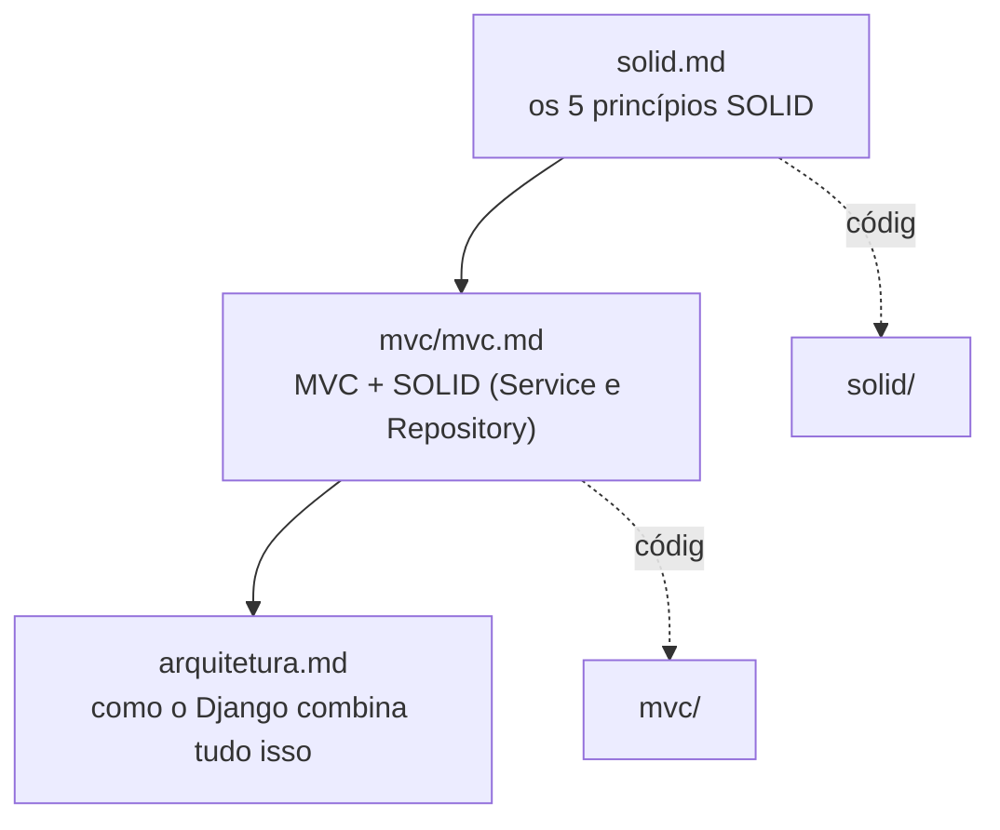

# Padrões de Design de Software (PDS)

Este material cobre dois assuntos que se apoiam um no outro: os cinco **princípios SOLID**, que orientam como desenhar os limites entre classes dentro de um programa, e como o **Django** — o framework usado no módulo DJ deste curso — combina, adapta e às vezes abandona esses mesmos princípios e outros padrões arquiteturais. Os dois são explicados com o mesmo domínio de exemplo — um sistema de gerenciamento de pedidos de uma loja online — e existe uma implementação de código executável para cada etapa, para que a teoria possa ser lida, rodada e alterada, não só lida.

O diagrama abaixo é o mapa de leitura recomendado. As setas cheias indicam dependência de conceitos (leia o documento de origem antes do de destino); as pontilhadas apontam para o código executável correspondente.

## Os documentos, em ordem

[`solid.md`](solid.md) aprofunda os cinco princípios SOLID, usando as classes `Pedido`, `Item`, `ProcessadorPagamento` e companhia do zero até um programa integrado. A implementação correspondente, que roda com `python main.py` sem nenhuma dependência externa, está em [`solid/`](solid/).

[`mvc/mvc.md`](mvc/mvc.md) documenta uma aplicação real de MVC com SQLAlchemy e persistência em SQLite local, implementada em [`mvc/`](mvc/) — já aplicando SRP e DIP: um `PedidoService` concentra a regra de negócio e um `IPedidoRepository` abstrato isola o acesso a dados, deixando o `PedidoController` só orquestrando entrada e saída.

[`arquitetura.md`](arquitetura.md) é o capítulo final: mostra como o Django combina MTV (sua releitura do MVC), fusão de Domínio e Persistência via Active Record, Front Controller, Pluggable Apps, Middleware como Chain of Responsibility e backends plugáveis via Strategy + Adapter — e complementa com o catálogo de padrões de projeto (GoF) usados por dentro do framework: Observer nos *signals*, Template Method nas Class-Based Views, Facade, Proxy, Builder, Factory, Composite, Decorator, Command e Descriptor. Fecha explicando o que o Django deliberadamente não traz — Repository, Unit of Work, Service Layer — e como isso se relaciona com o que já foi construído em `mvc/`.

## As pastas de código

| Pasta | O que implementa | Como rodar |
|---|---|---|
| [`solid/`](solid/) | Os 5 princípios SOLID, sem banco de dados | `cd solid && python main.py` |
| [`mvc/`](mvc/) | MVC com SQLAlchemy, SQLite local e SOLID aplicado (Service + Repository) | `cd mvc && pip install -r requirements.txt && python main.py` |

`mvc/` sempre usa um arquivo SQLite local (`db_pedidos.db`), criado automaticamente na primeira execução, sem nenhuma dependência de banco externo. `arquitetura.md` não tem pasta de código própria — os exemplos de Django ali são ilustrativos, para teoria, não um projeto completo.
