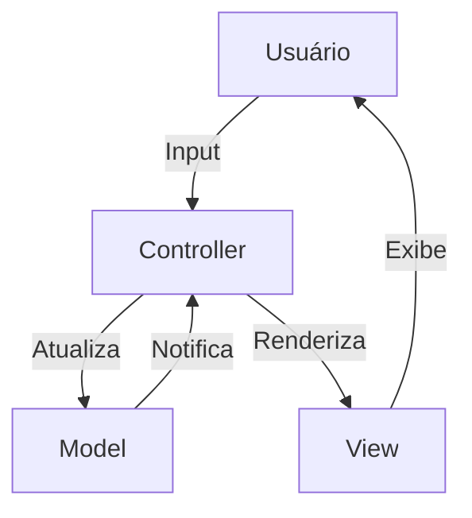
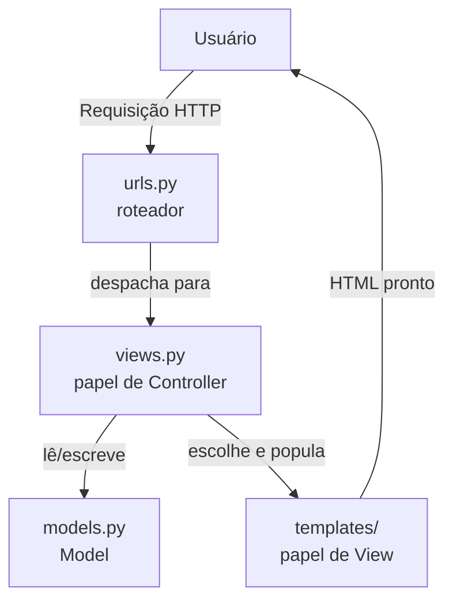
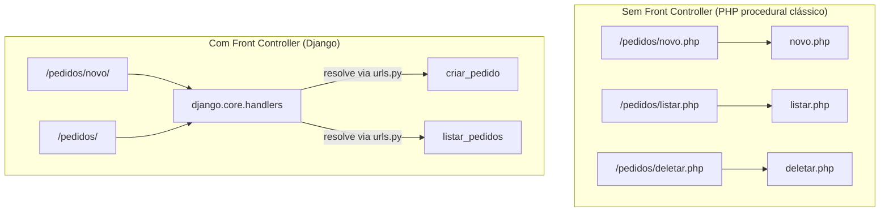
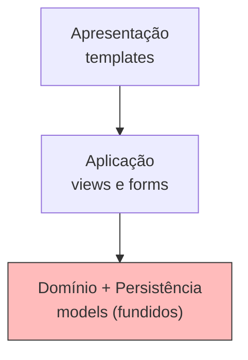
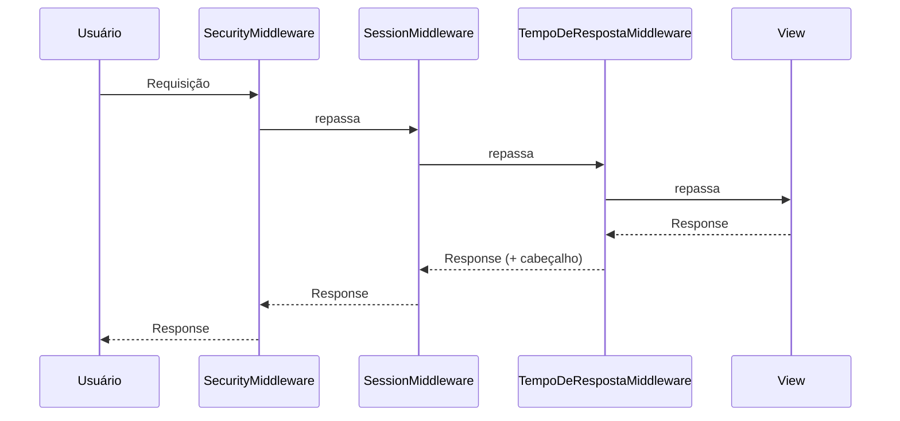
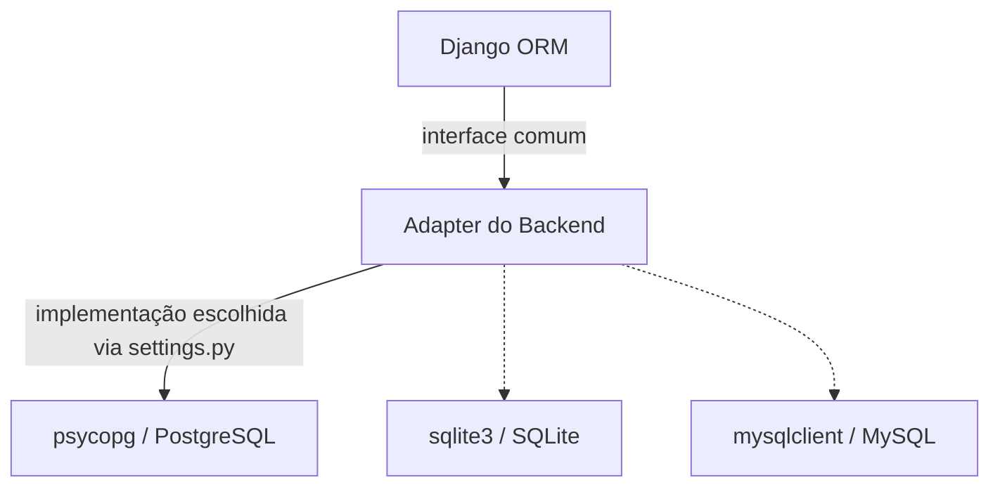

# Padrões de Arquitetura e de Projeto no Django

Django combina padrões em dois níveis distintos, e misturar os dois é a fonte mais comum de confusão de quem estuda o framework. No nível **arquitetural**, padrões definem a estrutura geral da aplicação — como MTV, a arquitetura em camadas ou o Front Controller, que decidem onde cada tipo de código deve morar. No nível de **padrão de projeto** (o catálogo GoF — Gang of Four, os quatro autores do livro *Design Patterns*), os padrões aparecem na implementação interna do próprio framework: o Django usa Observer para *signals*, Template Method para as Class-Based Views, Facade em `django.shortcuts`, e vários outros, listados na Seção 2. A diferença é de escala: um padrão arquitetural organiza módulos inteiros; um padrão de projeto resolve o relacionamento entre um punhado de classes.

---

## Pré-requisito: os princípios SOLID

Antes de entrar em MVC e no restante deste documento, vale fixar os cinco princípios SOLID — não são um padrão arquitetural nem um padrão de projeto, são as diretrizes de design que decidem *como* as classes dentro de qualquer um desses padrões devem se relacionar. É por causa do SOLID, por exemplo, que a implementação de MVC discutida na Seção 1.1 separa `PedidoService` e `IPedidoRepository` do Controller, em vez de deixar tudo numa classe só.

[`solid.md`](/PDS/solid.md) explica os cinco princípios (SRP, OCP, LSP, ISP, DIP) do zero até um programa integrado, com a implementação correspondente em [`PDS/solid/`](/PDS/solid/).

📦 [Baixar o projeto completo (solid.zip)](/PDS/solid.zip) — mesma pasta `PDS/solid/`, pronta para extrair e rodar com `python main.py`, sem nenhuma dependência externa.

---

## 1. Nível Arquitetural

### 1.1 MVC (Model-View-Controller)

Antes de comparar com o MTV do Django, vale fixar o MVC clássico, que é o padrão sendo reinterpretado. MVC divide a aplicação em três papéis: o **Model** concentra os dados e a lógica de negócios; a **View** exibe informações e coleta entradas do usuário; o **Controller** recebe as ações do usuário, decide o que fazer com o Model e manda a View se atualizar. A vantagem prática é que a mesma lógica de negócios pode ganhar interfaces diferentes — um terminal, uma página web, uma API — sem duplicar regra nenhuma, porque toda ela mora no Model; o Controller é o único ponto que muda para se adaptar à interface.



```python
# models.py (Model)
class Pedido:
    def __init__(self, cliente):
        self.cliente = cliente

# controller.py (Controller)
class PedidoController:
    def criar_pedido(self, cliente):
        return Pedido(cliente)

# view.py (View)
class PedidoView:
    def exibir_pedido(self, pedido):
        print(f"Pedido para {pedido.cliente}")
```

A implementação completa deste padrão — com banco de dados, tratamento de erros e os princípios SOLID aplicados via Service e Repository — está em [`PDS/mvc/mvc.md`](/PDS/mvc/mvc.md), com o código correspondente em [`PDS/mvc/`](/PDS/mvc/). É esse MVC "de livro-texto" que a próxima seção compara com o MTV do Django — o mapeamento entre os dois é o primeiro ponto de confusão de quem chega no framework já conhecendo o padrão clássico.

📦 [Baixar o projeto completo (mvc.zip)](/PDS/mvc.zip) — mesma pasta `PDS/mvc/`, pronta para extrair e rodar com `pip install -r requirements.txt && python main.py`.

### 1.2 MTV (Model–Template–View)

Django se autodenomina **MTV**, a releitura própria do framework para o MVC — e o mapeamento entre os dois vocabulários é cruzado, não uma simples troca de nome por nome.

| MVC clássico | Django |
|---|---|
| Model | Model (ORM) |
| View (apresentação) | Template |
| Controller | View (função ou Class-Based View) |

O que Django chama de **View** (o arquivo `views.py`) ocupa o papel do **Controller** do MVC clássico: recebe a requisição, decide o que fazer, escolhe o que devolver. O que Django chama de **Template** ocupa o papel da **View** do MVC clássico: só formata dados para exibição. O "controller" propriamente dito, no sentido de "o que primeiro recebe toda requisição e decide para onde ela vai", não é nenhum arquivo do projeto — é o próprio framework: o URL dispatcher somado ao handler WSGI/ASGI, tema da próxima seção.



```python
# models.py — Model
from django.db import models

class Pedido(models.Model):
    cliente = models.CharField(max_length=100)
    data_pedido = models.DateField(auto_now_add=True)

    def calcular_total(self):
        return sum(item.preco * item.quantidade for item in self.itens.all())


class ItemPedido(models.Model):
    pedido = models.ForeignKey(Pedido, related_name="itens", on_delete=models.CASCADE)
    produto = models.CharField(max_length=100)
    quantidade = models.IntegerField()
    preco = models.DecimalField(max_digits=10, decimal_places=2)
```

```python
# views.py — papel de Controller, apesar do nome
from django.shortcuts import render, redirect
from .models import Pedido

def criar_pedido(request):
    if request.method == "POST":
        Pedido.objects.create(cliente=request.POST["cliente"])
        return redirect("listar_pedidos")
    return render(request, "pedidos/form.html")

def listar_pedidos(request):
    pedidos = Pedido.objects.all()
    return render(request, "pedidos/lista.html", {"pedidos": pedidos})  # aciona o Template
```

```html
<!-- templates/pedidos/lista.html — papel de View -->

  <p>Pedido de {{ pedido.cliente }} — Total: R$ {{ pedido.calcular_total }}</p>

```

Compare com `PDS/mvc/mvc.md`: `PedidoController.criar_pedido` ali corresponde à função `criar_pedido` em `views.py` aqui; `PedidoView.exibir_pedido` ali corresponde ao template `lista.html` aqui — o mesmo papel, exercido por peças com nomes diferentes.

### 1.3 Front Controller

Todo request entra por um ponto único — `django.core.handlers` — que resolve a rota e delega para a view apropriada. Nenhuma requisição chega diretamente a um script isolado, como acontecia em PHP procedural clássico, onde cada URL correspondia a um arquivo `.php` que o servidor executava diretamente. Esse ponto único de entrada é o **Front Controller**: toda lógica comum a todas as requisições — resolução de rota, execução dos middlewares, tratamento de exceções não capturadas — passa por ele antes de qualquer view específica ser chamada.



### 1.4 Arquitetura em Camadas — fundida pelo Active Record

Um projeto Django tem uma separação que lembra a Arquitetura em Camadas: **Apresentação** (templates), **Aplicação** (views e forms) e **Domínio + Persistência** (models). A diferença para uma implementação de Camadas convencional está no terceiro nível: domínio e persistência ficam **fundidos** na mesma classe, consequência direta do Active Record (detalhado na Seção 2). Em `PDS/mvc/`, `PedidoService` (Negócios) e `PedidoRepository` (Persistência) são duas classes distintas; em Django, o `Model` faz o papel das duas ao mesmo tempo — ele guarda os dados **e** sabe se salvar.



### 1.5 Pluggable Apps

O `INSTALLED_APPS`, em `settings.py`, implementa uma arquitetura de plugins com um registro central, `django.apps.registry` — um **Singleton**, no sentido do padrão de projeto: existe exatamente uma instância desse registro por processo Django, e qualquer parte do framework que precise saber quais apps estão instalados consulta essa mesma instância. Cada app é um módulo autocontido, com seus próprios `models.py`, `views.py`, `urls.py` — princípio que a documentação do Django chama de *loose coupling*: um app pode, em teoria, ser removido de `INSTALLED_APPS` sem quebrar os outros.

```python
# settings.py
INSTALLED_APPS = [
    "django.contrib.admin",
    "django.contrib.auth",
    "django.contrib.sessions",
    "pedidos",       # app próprio do projeto
    "pagamentos",    # outro app próprio, desacoplado de "pedidos"
]
```

### 1.6 Middleware — Chain of Responsibility

Toda requisição do Django atravessa uma lista ordenada de **middlewares** antes de chegar na view, e a resposta atravessa a mesma lista, na ordem inversa, antes de voltar ao usuário — um padrão de pipeline, também chamado **Chain of Responsibility**: cada elo decide se repassa a requisição adiante, se a modifica antes de repassar, ou se interrompe a cadeia e responde direto.

```python
# settings.py
MIDDLEWARE = [
    "django.middleware.security.SecurityMiddleware",
    "django.contrib.sessions.middleware.SessionMiddleware",
    "django.middleware.common.CommonMiddleware",
    "django.middleware.csrf.CsrfViewMiddleware",
    "django.contrib.auth.middleware.AuthenticationMiddleware",
]
```

```python
# middleware.py — um elo customizado na mesma cadeia
import time

class TempoDeRespostaMiddleware:
    def __init__(self, get_response):
        self.get_response = get_response  # próximo elo da cadeia

    def __call__(self, request):
        inicio = time.time()
        response = self.get_response(request)  # repassa para o próximo middleware, ou para a view
        response["X-Tempo-Resposta"] = f"{time.time() - inicio:.3f}s"
        return response
```



`SecurityMiddleware` pode interromper a cadeia e responder direto a uma requisição maliciosa, sem que ela chegue a `SessionMiddleware` ou à view — a mesma lógica de qualquer Chain of Responsibility: cada elo tem autoridade para não repassar adiante.

### 1.7 Backends Plugáveis — Strategy + Adapter

Cache, autenticação, storage, e-mail, template engines e bancos de dados são intercambiáveis via configuração — um **Strategy** em larga escala: o comportamento (como cachear, como autenticar, onde guardar arquivos) é escolhido por configuração, não por código espalhado em `if`s. Por trás de cada escolha existe um **Adapter**: o backend de banco de dados, por exemplo, adapta bibliotecas de baixo nível como `psycopg` (PostgreSQL) ou o `sqlite3` da biblioteca padrão a uma interface comum, a mesma para o ORM inteiro — trocar `sqlite3` por `psycopg` não muda uma linha de `models.py` ou `views.py`.

```python
# settings.py — trocar a estratégia de banco sem tocar em nenhuma view ou model
DATABASES = {
    "default": {
        "ENGINE": "django.db.backends.postgresql",  # troque para "django.db.backends.sqlite3"
        "NAME": "loja",
        "USER": "loja_user",
        "PASSWORD": "senha",
        "HOST": "localhost",
    }
}
```



---

## 2. Padrões de Projeto (GoF) no Interior do Framework

| Padrão | Onde aparece no Django |
|---|---|
| **Active Record** | O `Model` sabe se salvar: `pedido.save()` |
| **Observer / Pub-Sub** | Sistema de *signals*: `post_save`, `pre_delete` |
| **Template Method** | Class-Based Views: `dispatch()` define o esqueleto do fluxo |
| **Facade** | `django.shortcuts` — `render()`, `get_object_or_404()` |
| **Proxy / Lazy Loading** | `QuerySet` preguiçoso, `request.user`, `gettext_lazy()` |
| **Builder / Interface fluente** | `Model.objects.filter(...).exclude(...).order_by(...)` |
| **Factory** | `Manager` (`Model.objects`) como fábrica de `QuerySet`s |
| **Composite** | Objetos `Q`, combinados com `\|` e `&` |
| **Decorator** | `@login_required`, `@require_POST`, `@cached_property` |
| **Command** | *Management commands* — `BaseCommand.handle()` |
| **Descriptor**¹ | Os `Field` do ORM interceptam acesso a atributos |

¹ Específico de Python, não pertence ao catálogo GoF original.

Cada um em detalhe — para que serve, como funciona, onde exatamente aparece:

**Active Record** existe para dar ao próprio objeto de domínio a capacidade de se persistir, sem precisar de uma classe separada cuidando disso. Funciona porque o `Model` herda de uma base que já implementa `save()`, `delete()` e expõe um `Manager` (`.objects`) para consultas — todo `Model` criado carrega esse comportamento de graça. Em Django, isso é literal: `pedido.save()` grava no banco, `Pedido.objects.filter(cliente="Ana Paula")` consulta — o dado e a forma de persisti-lo moram na mesma classe. Difere do Data Mapper do SQLAlchemy, usado em `PDS/mvc/`, onde `PedidoRepository` é uma classe à parte que persiste `Pedido` sem que `Pedido` saiba disso.

**Observer / Pub-Sub** existe para permitir que várias partes do sistema reajam a um evento sem que quem dispara o evento precise conhecer quem está ouvindo. Funciona com um despachante central que mantém uma lista de funções inscritas para um evento específico e, quando o evento acontece, chama cada uma delas passando os dados. Em Django, é o sistema de *signals*: `post_save`, `pre_delete` e outros são disparados automaticamente pelo ORM, e qualquer função decorada com `@receiver(post_save, sender=Pedido)` passa a ser notificada sempre que um `Pedido` for salvo.

**Template Method** existe para fixar o roteiro de um processo numa classe-base, deixando só os pontos que variam para as subclasses preencherem. Funciona porque um método da classe-base chama, numa ordem já definida, uma sequência de outros métodos — alguns fixos, outros feitos para serem sobrescritos — sem que a subclasse precise reescrever a ordem inteira. Em Django, é a espinha dorsal das Class-Based Views: `ListView.dispatch()` já sabe buscar o queryset, montar o contexto, escolher o template e renderizar; a subclasse só sobrescreve `get_queryset()`, `get_context_data()` ou `form_valid()` nos pontos certos.

**Facade** existe para esconder atrás de uma função só a complexidade de vários subsistemas que, juntos, resolvem uma tarefa comum. Funciona porque a função de fachada aciona internamente várias classes — carregar o template, montar o contexto, renderizar HTML, embrulhar numa resposta HTTP — e expõe para quem chama só os parâmetros que importam. Em Django, `render()` e `get_object_or_404()`, ambos em `django.shortcuts`, são exatamente isso: uma chamada simples escondendo `Template`, `Context`, `HttpResponse` e tratamento de exceção por trás.

**Proxy / Lazy Loading** existe para adiar um trabalho caro até o momento em que o resultado é de fato necessário, evitando gastar tempo com algo que talvez nunca seja usado. Funciona com um objeto-substituto que intercepta o primeiro acesso, dispara a operação real só nessa hora, e guarda o resultado para os acessos seguintes. Em Django, um `QuerySet` não roda SQL nenhum até ser iterado ou convertido em lista; `request.user` é um `SimpleLazyObject` que só busca o usuário no banco quando algum atributo dele é lido pela primeira vez; `gettext_lazy()` adia a tradução de um texto até o momento em que ele é efetivamente exibido.

**Builder / Interface fluente** existe para construir um objeto complexo — aqui, uma consulta SQL — aos poucos, em vez de exigir um único construtor com dezenas de parâmetros. Funciona porque cada método de construção devolve uma nova instância (ou uma cópia ajustada) do próprio construtor, permitindo encadear chamada após chamada até fechar a construção. Em Django, `Model.objects.filter(...).exclude(...).order_by(...)` é esse encadeamento: cada `QuerySet` é imutável, e cada chamada devolve um novo `QuerySet` com mais uma condição embutida.

**Factory** existe para centralizar a criação de objetos numa classe própria, em vez de espalhar chamadas de construtor pelo código inteiro. Funciona porque a classe fábrica expõe métodos que já sabem montar e devolver instâncias prontas do tipo que ela produz. Em Django, `Model.objects` é um `Manager` — a fábrica que produz `QuerySet`s para aquele `Model` — e um `Form` também é uma fábrica, gerando seus campos e widgets a partir da declaração da classe.

**Composite** existe para que um objeto individual e uma composição de vários objetos possam ser tratados pela mesma interface, sem que quem usa precise diferenciar os dois casos. Funciona com uma estrutura em árvore, onde cada nó — folha ou composto — responde ao mesmo método, e um nó composto só repassa a chamada para seus filhos. Em Django, objetos `Q` são essa árvore: `Q(cliente="Ana Paula") | (Q(ano=2026) & ~Q(cliente="Bruno Costa"))` combina folhas e sub-árvores, e `.filter()` sabe processar a árvore inteira do mesmo jeito, não importa quantos níveis ela tenha.

**Decorator** existe para acrescentar comportamento a uma função sem alterar o código-fonte dela. Funciona porque uma função decoradora recebe a função original como argumento e devolve uma nova função, que roda lógica extra antes ou depois de chamar a original. Em Django, `@login_required` barra o acesso antes da view rodar; `@require_POST` rejeita métodos HTTP errados; `@cached_property` guarda o resultado de um cálculo caro na primeira chamada e devolve o valor guardado nas seguintes.

**Command** existe para transformar uma ação em um objeto, para que ela possa ser invocada, listada ou reutilizada de forma padronizada, em vez de ser só uma função solta. Funciona porque cada ação vira uma classe com um único método de execução, seguindo a mesma interface de todas as outras ações do mesmo tipo. Em Django, cada *management command* é uma classe que herda de `BaseCommand` e implementa `handle()`, executável de modo uniforme via `python manage.py nome_do_comando`, seja qual for o comando.

**Descriptor**¹ existe para interceptar o acesso de leitura ou escrita a um atributo de uma classe, rodando lógica extra nesse exato momento. Funciona porque a classe implementa os métodos especiais `__get__` e/ou `__set__`, que o próprio Python chama automaticamente sempre que o atributo é lido ou escrito num objeto — sem que quem lê o atributo perceba que algo além de uma leitura simples está acontecendo. Em Django, os `Field` do ORM usam esse protocolo para, por exemplo, fazer uma `ForeignKey` disparar uma consulta ao banco só no instante em que o atributo relacionado é de fato lido, não quando o objeto é criado.

---


## 3. Referências para Aprofundamento

- Django Documentation — *FAQ: Django appears to be a MVC framework...*
- Django Documentation — *Design philosophies*
- Martin Fowler — *Patterns of Enterprise Application Architecture* (Active Record, Data Mapper, Front Controller)
- Gamma, Helm, Johnson, Vlissides — *Design Patterns* (GoF)
- Percival & Gregory — *Architecture Patterns with Python*
