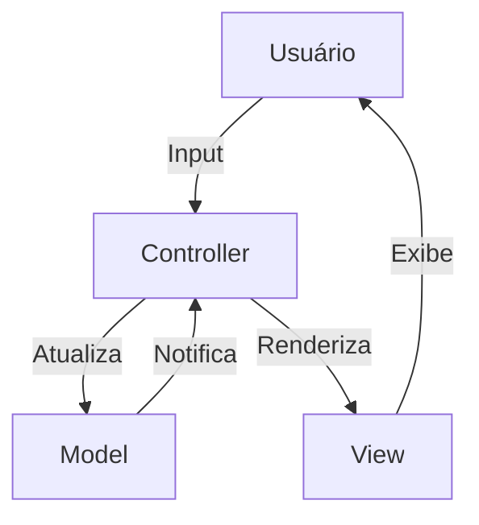
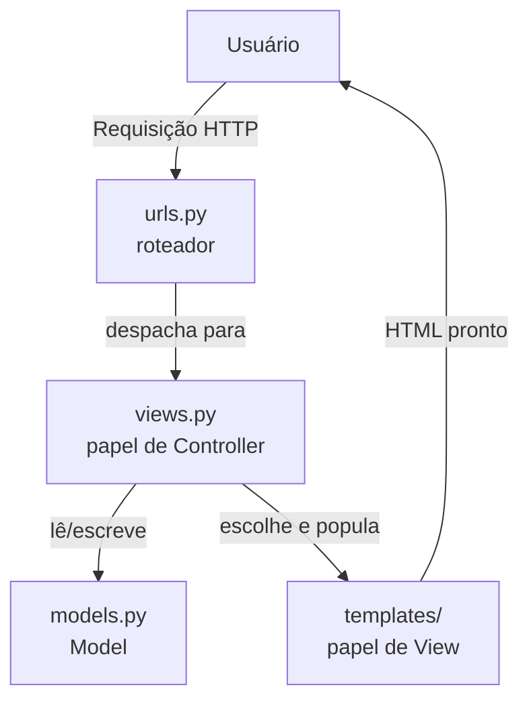
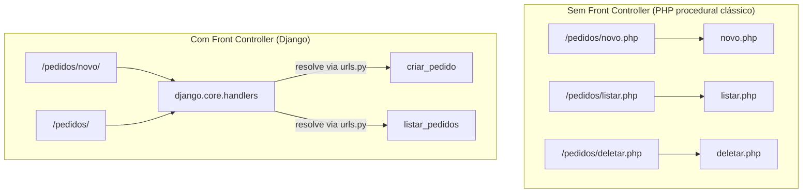
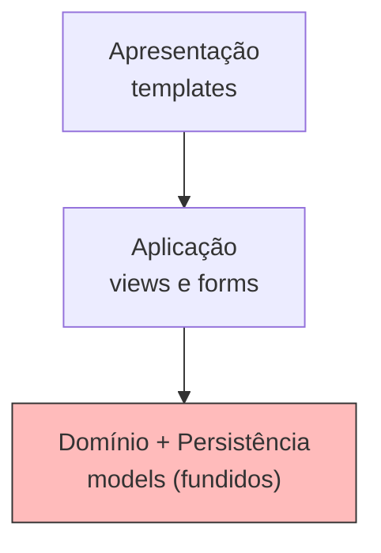
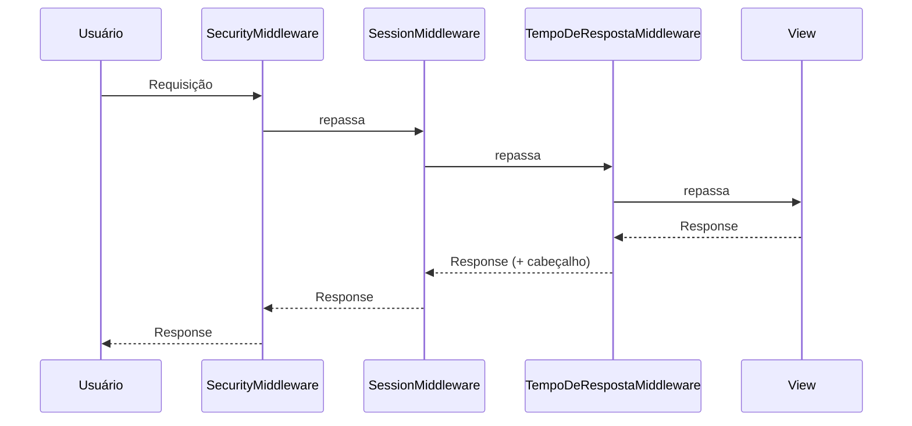
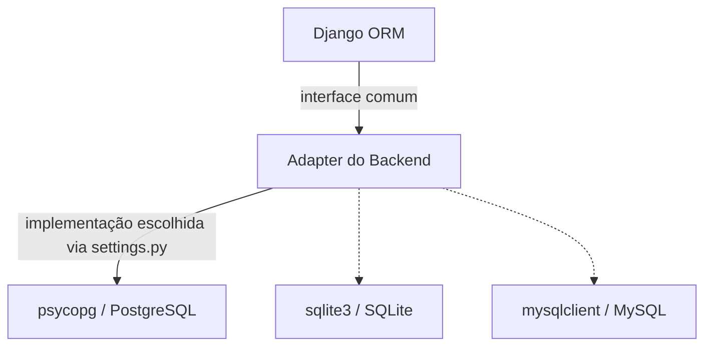
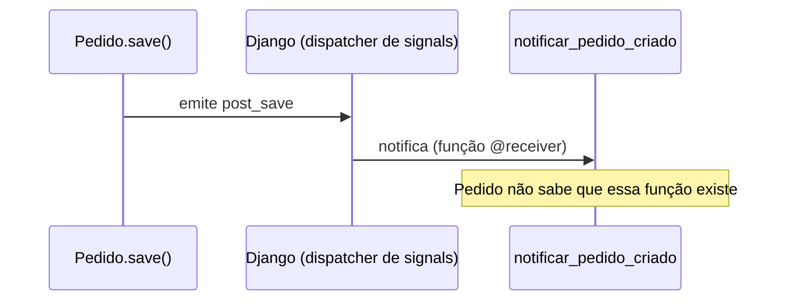

# Padrões de Arquitetura e de Projeto no Django

Django combina padrões em dois níveis distintos, e misturar os dois é a fonte mais comum de confusão de quem estuda o framework. No nível **arquitetural**, padrões definem a estrutura geral da aplicação — como MTV, a arquitetura em camadas ou o Front Controller, que decidem onde cada tipo de código deve morar. No nível de **padrão de projeto** (o catálogo GoF — Gang of Four, os quatro autores do livro *Design Patterns*), os padrões aparecem na implementação interna do próprio framework: o Django usa Observer para *signals*, Template Method para as Class-Based Views, Facade em `django.shortcuts`, e vários outros, listados na Seção 2. A diferença é de escala: um padrão arquitetural organiza módulos inteiros; um padrão de projeto resolve o relacionamento entre um punhado de classes.

---

## 1. Nível Arquitetural

### 1.1 MVC (Model-View-Controller)

Antes de comparar com o MTV do Django, vale fixar o MVC clássico, que é o padrão sendo reinterpretado. MVC divide a aplicação em três papéis: o **Model** concentra os dados e a lógica de negócios; a **View** exibe informações e coleta entradas do usuário; o **Controller** recebe as ações do usuário, decide o que fazer com o Model e manda a View se atualizar. A vantagem prática é que a mesma lógica de negócios pode ganhar interfaces diferentes — um terminal, uma página web, uma API — sem duplicar regra nenhuma, porque toda ela mora no Model; o Controller é o único ponto que muda para se adaptar à interface.



```python
# models.py (Model)
class Pedido:
    def __init__(self, cliente):
        self.cliente = cliente

# controller.py (Controller)
class PedidoController:
    def criar_pedido(self, cliente):
        return Pedido(cliente)

# view.py (View)
class PedidoView:
    def exibir_pedido(self, pedido):
        print(f"Pedido para {pedido.cliente}")
```

A implementação completa deste padrão — com banco de dados, tratamento de erros e a discussão de um Controller que acaba violando o SRP — está em [`PDS/mvc/mvc.md`](/PDS/mvc/mvc.md), com o código correspondente em [`PDS/mvc/`](/PDS/mvc/). É esse MVC "de livro-texto" que a próxima seção compara com o MTV do Django — o mapeamento entre os dois é o primeiro ponto de confusão de quem chega no framework já conhecendo o padrão clássico.

### 1.2 MTV (Model–Template–View)

Django se autodenomina **MTV**, a releitura própria do framework para o MVC — e o mapeamento entre os dois vocabulários é cruzado, não uma simples troca de nome por nome.

| MVC clássico | Django |
|---|---|
| Model | Model (ORM) |
| View (apresentação) | Template |
| Controller | View (função ou Class-Based View) |

O que Django chama de **View** (o arquivo `views.py`) ocupa o papel do **Controller** do MVC clássico: recebe a requisição, decide o que fazer, escolhe o que devolver. O que Django chama de **Template** ocupa o papel da **View** do MVC clássico: só formata dados para exibição. O "controller" propriamente dito, no sentido de "o que primeiro recebe toda requisição e decide para onde ela vai", não é nenhum arquivo do projeto — é o próprio framework: o URL dispatcher somado ao handler WSGI/ASGI, tema da próxima seção.



```python
# models.py — Model
from django.db import models

class Pedido(models.Model):
    cliente = models.CharField(max_length=100)
    data_pedido = models.DateField(auto_now_add=True)

    def calcular_total(self):
        return sum(item.preco * item.quantidade for item in self.itens.all())


class ItemPedido(models.Model):
    pedido = models.ForeignKey(Pedido, related_name="itens", on_delete=models.CASCADE)
    produto = models.CharField(max_length=100)
    quantidade = models.IntegerField()
    preco = models.DecimalField(max_digits=10, decimal_places=2)
```

```python
# views.py — papel de Controller, apesar do nome
from django.shortcuts import render, redirect
from .models import Pedido

def criar_pedido(request):
    if request.method == "POST":
        Pedido.objects.create(cliente=request.POST["cliente"])
        return redirect("listar_pedidos")
    return render(request, "pedidos/form.html")

def listar_pedidos(request):
    pedidos = Pedido.objects.all()
    return render(request, "pedidos/lista.html", {"pedidos": pedidos})  # aciona o Template
```

```html
<!-- templates/pedidos/lista.html — papel de View -->

  <p>Pedido de {{ pedido.cliente }} — Total: R$ {{ pedido.calcular_total }}</p>

```

Compare com `PDS/mvc/mvc.md`: `PedidoController.criar_pedido` ali corresponde à função `criar_pedido` em `views.py` aqui; `PedidoView.exibir_pedido` ali corresponde ao template `lista.html` aqui — o mesmo papel, exercido por peças com nomes diferentes.

### 1.3 Front Controller

Todo request entra por um ponto único — `django.core.handlers` — que resolve a rota e delega para a view apropriada. Nenhuma requisição chega diretamente a um script isolado, como acontecia em PHP procedural clássico, onde cada URL correspondia a um arquivo `.php` que o servidor executava diretamente. Esse ponto único de entrada é o **Front Controller**: toda lógica comum a todas as requisições — resolução de rota, execução dos middlewares, tratamento de exceções não capturadas — passa por ele antes de qualquer view específica ser chamada.



### 1.4 Arquitetura em Camadas — fundida pelo Active Record

Um projeto Django tem uma separação que lembra a Arquitetura em Camadas: **Apresentação** (templates), **Aplicação** (views e forms) e **Domínio + Persistência** (models). A diferença para uma implementação de Camadas convencional está no terceiro nível: domínio e persistência ficam **fundidos** na mesma classe, consequência direta do Active Record (detalhado na Seção 2). Em `PDS/mvc/`, `PedidoService` (Negócios) e `PedidoRepository` (Persistência) são duas classes distintas; em Django, o `Model` faz o papel das duas ao mesmo tempo — ele guarda os dados **e** sabe se salvar.



### 1.5 Pluggable Apps

O `INSTALLED_APPS`, em `settings.py`, implementa uma arquitetura de plugins com um registro central, `django.apps.registry` — um **Singleton**, no sentido do padrão de projeto: existe exatamente uma instância desse registro por processo Django, e qualquer parte do framework que precise saber quais apps estão instalados consulta essa mesma instância. Cada app é um módulo autocontido, com seus próprios `models.py`, `views.py`, `urls.py` — princípio que a documentação do Django chama de *loose coupling*: um app pode, em teoria, ser removido de `INSTALLED_APPS` sem quebrar os outros.

```python
# settings.py
INSTALLED_APPS = [
    "django.contrib.admin",
    "django.contrib.auth",
    "django.contrib.sessions",
    "pedidos",       # app próprio do projeto
    "pagamentos",    # outro app próprio, desacoplado de "pedidos"
]
```

### 1.6 Middleware — Chain of Responsibility

Toda requisição do Django atravessa uma lista ordenada de **middlewares** antes de chegar na view, e a resposta atravessa a mesma lista, na ordem inversa, antes de voltar ao usuário — um padrão de pipeline, também chamado **Chain of Responsibility**: cada elo decide se repassa a requisição adiante, se a modifica antes de repassar, ou se interrompe a cadeia e responde direto.

```python
# settings.py
MIDDLEWARE = [
    "django.middleware.security.SecurityMiddleware",
    "django.contrib.sessions.middleware.SessionMiddleware",
    "django.middleware.common.CommonMiddleware",
    "django.middleware.csrf.CsrfViewMiddleware",
    "django.contrib.auth.middleware.AuthenticationMiddleware",
]
```

```python
# middleware.py — um elo customizado na mesma cadeia
import time

class TempoDeRespostaMiddleware:
    def __init__(self, get_response):
        self.get_response = get_response  # próximo elo da cadeia

    def __call__(self, request):
        inicio = time.time()
        response = self.get_response(request)  # repassa para o próximo middleware, ou para a view
        response["X-Tempo-Resposta"] = f"{time.time() - inicio:.3f}s"
        return response
```



`SecurityMiddleware` pode interromper a cadeia e responder direto a uma requisição maliciosa, sem que ela chegue a `SessionMiddleware` ou à view — a mesma lógica de qualquer Chain of Responsibility: cada elo tem autoridade para não repassar adiante.

### 1.7 Backends Plugáveis — Strategy + Adapter

Cache, autenticação, storage, e-mail, template engines e bancos de dados são intercambiáveis via configuração — um **Strategy** em larga escala: o comportamento (como cachear, como autenticar, onde guardar arquivos) é escolhido por configuração, não por código espalhado em `if`s. Por trás de cada escolha existe um **Adapter**: o backend de banco de dados, por exemplo, adapta bibliotecas de baixo nível como `psycopg` (PostgreSQL) ou o `sqlite3` da biblioteca padrão a uma interface comum, a mesma para o ORM inteiro — trocar `sqlite3` por `psycopg` não muda uma linha de `models.py` ou `views.py`.

```python
# settings.py — trocar a estratégia de banco sem tocar em nenhuma view ou model
DATABASES = {
    "default": {
        "ENGINE": "django.db.backends.postgresql",  # troque para "django.db.backends.sqlite3"
        "NAME": "loja",
        "USER": "loja_user",
        "PASSWORD": "senha",
        "HOST": "localhost",
    }
}
```



---

## 2. Padrões de Projeto (GoF) no Interior do Framework

| Padrão | Onde aparece no Django |
|---|---|
| **Active Record** | O `Model` sabe se salvar: `pedido.save()`. Difere do Data Mapper do SQLAlchemy — veja `PDS/mvc/`, onde `PedidoRepository` separa o objeto de domínio (`Pedido`) da persistência |
| **Observer / Pub-Sub** | Sistema de *signals*: `post_save`, `pre_delete` |
| **Template Method** | Class-Based Views: `dispatch()` define o esqueleto do fluxo; subclasses sobrescrevem `get_context_data()`, `form_valid()`, `get_queryset()` |
| **Facade** | `django.shortcuts` — `render()`, `get_object_or_404()` escondem vários subsistemas atrás de uma função só |
| **Proxy / Lazy Loading** | Um `QuerySet` só executa SQL quando é iterado; `request.user` é um `SimpleLazyObject`; `gettext_lazy()` adia a tradução até o texto ser exibido |
| **Builder / Interface fluente** | `Model.objects.filter(...).exclude(...).order_by(...)` — cada chamada devolve um novo `QuerySet`, encadeável |
| **Factory** | `Manager` (`Model.objects`) como fábrica de `QuerySet`s; `Form` gerando campos e widgets a partir da declaração da classe |
| **Composite** | Objetos `Q` formam uma árvore de expressões booleanas; formsets agregam vários `Form` sob a mesma interface de um `Form` só |
| **Decorator** | `@login_required`, `@require_POST`, `@cached_property` |
| **Command** | *Management commands* — cada comando é uma classe com `BaseCommand.handle()`, executável via `python manage.py nome_do_comando` |
| **Descriptor**¹ | Os `Field` do ORM usam o protocolo de descritores do Python para interceptar o acesso a atributos — é o que permite a uma ForeignKey disparar uma query só quando o atributo é lido |

¹ Específico de Python, não pertence ao catálogo GoF original.

### Observer: signals

```python
# signals.py
from django.db.models.signals import post_save
from django.dispatch import receiver
from .models import Pedido

@receiver(post_save, sender=Pedido)
def notificar_pedido_criado(sender, instance, created, **kwargs):
    if created:
        print(f"[Signal] Pedido de {instance.cliente} foi criado!")
```



A diferença para um Event-Driven "de verdade" é de garantias: um signal roda de forma síncrona, dentro do mesmo processo, e desaparece se o processo cair antes de processá-lo — não há fila, não há broker, sem garantia de entrega entre serviços diferentes. Para isso, um projeto Django precisaria de uma fila real, como Celery com RabbitMQ ou Redis.

### Template Method: Class-Based Views

```python
# views.py
from django.views.generic import ListView
from .models import Pedido

class PedidoListView(ListView):
    model = Pedido

    def get_queryset(self):                          # ponto de extensão
        return super().get_queryset().order_by("-data_pedido")

    def get_context_data(self, **kwargs):             # ponto de extensão
        ctx = super().get_context_data(**kwargs)
        ctx["total_pedidos"] = self.get_queryset().count()
        return ctx
```

`ListView.dispatch()` (herdado, não reescrito aqui) já sabe o roteiro inteiro — buscar o queryset, montar o contexto, escolher o template, renderizar — e chama `get_queryset()` e `get_context_data()` em pontos fixos desse roteiro. `PedidoListView` só personaliza esses dois pontos; o esqueleto do fluxo pertence à classe-base, nunca é reescrito pela subclasse.

### Composite: objetos `Q`

```python
from django.db.models import Q

Pedido.objects.filter(
    Q(cliente="Ana Paula") | (Q(data_pedido__year=2026) & ~Q(cliente="Bruno Costa"))
)
```

Cada `Q(...)` é uma folha; `|`, `&` e `~` combinam folhas e sub-árvores em uma árvore maior, e o método `.filter()` sabe processar a árvore inteira do mesmo jeito, não importa quantos níveis ela tenha — a definição central do Composite: tratar um objeto e uma composição de objetos de forma uniforme.

---

## 3. O Que o Django Deliberadamente Não Traz

- **Repository** — ausente; o `Manager` ocupa parcialmente esse espaço, mas sem a separação real entre objeto de domínio e acesso a dados que `IPedidoRepository` implementa em [`PDS/mvc/mvc.md`](/PDS/mvc/mvc.md).
- **Unit of Work explícito** — existe apenas `transaction.atomic`, que agrupa operações numa transação, mas não rastreia mudanças pendentes do jeito que um Unit of Work formal faria.
- **Service Layer** — ausente por design; a filosofia oficial é **fat models, thin views**: regra de negócio entra no próprio `Model` (como `calcular_total` no exemplo da Seção 1.2), a view fica magra, só orquestrando.

```python
# a única ferramenta de Unit of Work que o Django oferece nativamente
from django.db import transaction

with transaction.atomic():
    pedido = Pedido.objects.create(cliente="Ana Paula")
    ItemPedido.objects.create(pedido=pedido, produto="Livro", quantidade=1, preco=50.0)
    # se qualquer linha do bloco falhar, as duas operações são desfeitas juntas
```

Em sistemas maiores, a ausência dessas três peças vira ponto de tensão real: o acoplamento do Active Record ao ORM dificulta testar o domínio isoladamente, porque toda regra de negócio embutida em um `Model` carrega o ORM inteiro junto para dentro do teste. Daí surgem adaptações da comunidade, todas já demonstradas em código neste repositório:

- uma camada de serviços (`services.py` por app) — exatamente o que `PedidoService` faz em [`PDS/mvc/mvc.md`](/PDS/mvc/mvc.md);
- repositories construídos sobre managers, para reintroduzir a separação entre domínio e persistência — a mesma ideia de `IPedidoRepository` em [`PDS/mvc/mvc.md`](/PDS/mvc/mvc.md);
- Clean Architecture / Arquitetura Hexagonal, com o Django reduzido a uma camada de infraestrutura entre várias — a mesma disciplina de isolamento que [`PDS/mvc/mvc.md`](/PDS/mvc/mvc.md) aplica ao separar Model, Repository, Service e Controller em camadas próprias, cada uma com uma única razão para mudar.

---

## 4. Sugestão de Exercício

Apresentar aos alunos uma view com regra de negócio embutida e pedir que identifiquem:

1. Qual princípio arquitetural está sendo violado.
2. Para onde o código deveria migrar — model, manager ou service.
3. Qual o impacto disso na testabilidade.

Uma view "gorda" típica, para servir de ponto de partida:

```python
# views.py — regra de negócio, acesso a dados e apresentação misturados
def criar_pedido(request):
    if request.method == "POST":
        cliente = request.POST["cliente"]
        itens = request.POST.getlist("produto")
        if not cliente or not itens:
            return render(request, "pedidos/form.html", {"erro": "Dados inválidos"})
        pedido = Pedido.objects.create(cliente=cliente)
        for produto in itens:
            ItemPedido.objects.create(pedido=pedido, produto=produto, quantidade=1, preco=0)
        if pedido.calcular_total() > 1000:
            pedido.desconto_vip = True
            pedido.save()
        return redirect("listar_pedidos")
    return render(request, "pedidos/form.html")
```

Depois de discutir os três pontos, comparar com [`PDS/mvc/mvc.md`](/PDS/mvc/mvc.md), que resolve o mesmo tipo de mistura — ali dentro de um `PedidoController`, não de uma view de Django — extraindo `PedidoService` (a regra de negócio) e `IPedidoRepository` (o acesso a dados) para classes próprias, funciona como gabarito para o exercício.

---

## 5. Referências para Aprofundamento

- Django Documentation — *FAQ: Django appears to be a MVC framework...*
- Django Documentation — *Design philosophies*
- Martin Fowler — *Patterns of Enterprise Application Architecture* (Active Record, Data Mapper, Front Controller)
- Gamma, Helm, Johnson, Vlissides — *Design Patterns* (GoF)
- Percival & Gregory — *Architecture Patterns with Python*
