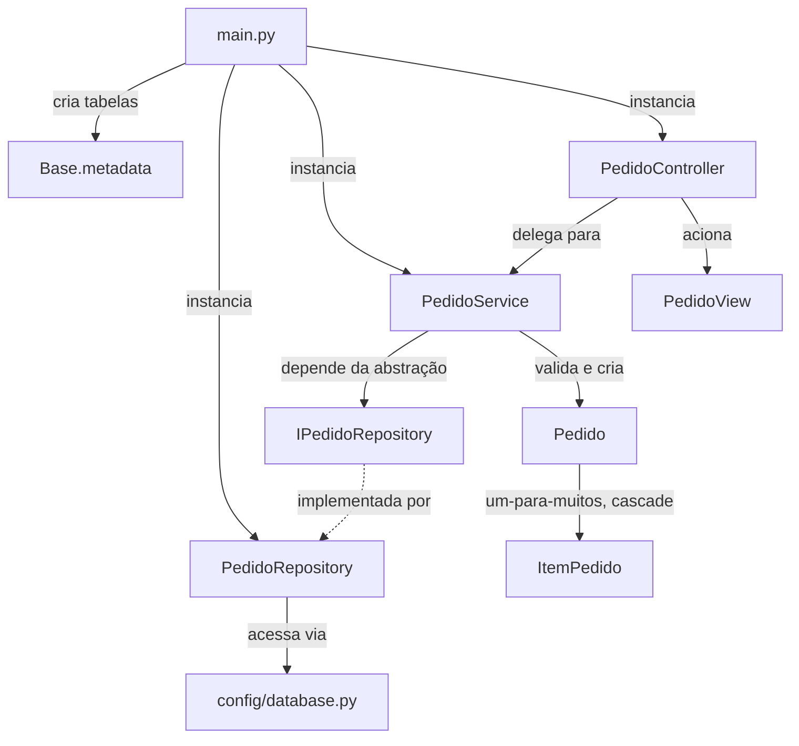

# Arquitetura e Estrutura do Projeto MVC

Esta pasta é a implementação concreta do MVC descrito em [`PDS/arquitetura.md`](/PDS/arquitetura.md#11-mvc-model-view-controller): um sistema de gerenciamento de pedidos (`Pedido`, `ItemPedido`) de uma loja online, persistido com SQLAlchemy em um arquivo SQLite local. Além dos três papéis clássicos do MVC, a estrutura aplica os cinco princípios SOLID (explicados em [`solid.md`](/PDS/solid.md)) na divisão interna do que seria só o "Controller": a lógica de negócio e o acesso a dados vivem em classes próprias, cada uma com uma única razão para mudar.

## Estrutura de pastas

```
mvc/
├── main.py                            # ponto de entrada
├── requirements.txt
├── config/
│   └── database.py                    # engine SQLAlchemy + fábrica de sessões
├── models/
│   ├── base.py                        # Base declarativa do SQLAlchemy
│   ├── pedido.py                      # Model: Pedido
│   └── item_pedido.py                 # Model: ItemPedido
├── views/
│   └── pedido_view.py                 # View: PedidoView
├── repositories/
│   ├── ipedido_repository.py          # Interface: IPedidoRepository (DIP)
│   └── pedido_repository.py           # Implementação: PedidoRepository (SQLAlchemy)
├── services/
│   └── pedido_service.py              # Regra de negócio: PedidoService (SRP)
└── controllers/
    └── pedido_controller.py           # Controller: só orquestra
```

`models/`, `views/` e `controllers/` continuam sendo os três papéis clássicos do MVC. `repositories/` e `services/` são a divisão interna do que, numa implementação mais simples, estaria tudo dentro do Controller — e é exatamente essa divisão que este documento existe para justificar.

## Visão geral da arquitetura



O Controller não fala mais com o banco nem decide regra de negócio — ele só recebe um `PedidoService` e uma `PedidoView` prontos (injeção de dependência) e coordena os dois. Quem de fato acessa o banco é `PedidoRepository`, e quem decide o que é um pedido válido é `PedidoService`. Nenhuma seta liga `PedidoController` diretamente a `PedidoRepository` ou a `Pedido` — tudo passa pelo `PedidoService` no meio.

---

## As classes, uma a uma

### `Base`, `Pedido`, `ItemPedido` — `models/`

```python
# base.py
from sqlalchemy.orm import declarative_base

Base = declarative_base()
```

```python
# pedido.py
from sqlalchemy import Column, Integer, String, Date
from sqlalchemy.orm import relationship
from datetime import date
from .base import Base

class Pedido(Base):
    __tablename__ = 'pedido'
    id = Column(Integer, primary_key=True, autoincrement=True)
    cliente = Column(String(100))
    data_pedido = Column(Date, default=date.today)
    itens = relationship("ItemPedido", back_populates="pedido", cascade="all, delete-orphan")
```

```python
# item_pedido.py
from sqlalchemy import Column, Integer, String, ForeignKey, DECIMAL
from sqlalchemy.orm import relationship
from .base import Base

class ItemPedido(Base):
    __tablename__ = 'item_pedido'
    id = Column(Integer, primary_key=True, autoincrement=True)
    pedido_id = Column(Integer, ForeignKey('pedido.id'))
    produto = Column(String(100))
    quantidade = Column(Integer)
    preco = Column(DECIMAL(10,2))

    pedido = relationship("Pedido", back_populates="itens")
```

Nenhuma dessas três classes mudou em relação a uma implementação de MVC mais simples: `Base` só dá a `Pedido` e `ItemPedido` o mapeamento automático para tabelas; `Pedido` guarda `cliente` e `data_pedido`, com `cascade="all, delete-orphan"` garantindo que apagar um pedido apaga seus itens junto; `ItemPedido` guarda `produto`, `quantidade` e `preco` (como `DECIMAL`, não `float`, para não perder precisão em dinheiro), ligado ao `Pedido` pela chave estrangeira `pedido_id`. Os Models não sabem nada sobre SOLID — a mudança inteira acontece nas camadas ao redor deles.

### `PedidoView` — `views/pedido_view.py`

```python
from models.pedido import Pedido

class PedidoView:
    @staticmethod
    def exibir_pedidos(pedidos):
        for p in pedidos:
            print(f"Pedido {p.id} - Cliente: {p.cliente} - Data: {p.data_pedido}")
            for i in p.itens:
                print(f"  Produto: {i.produto}, Quantidade: {i.quantidade}, Preço: {i.preco}")

    @staticmethod
    def exibir_mensagem(mensagem):
        print(mensagem)

    @staticmethod
    def exibir_erro(erro):
        print(f"Erro: {erro}")
```

Também não muda: três métodos estáticos, sem estado, só formatando texto. Continua sendo a única classe que efetivamente lê `Pedido.itens` para exibição.

### `IPedidoRepository` — `repositories/ipedido_repository.py`

```python
from abc import ABC, abstractmethod
from typing import List
from models.pedido import Pedido

class IPedidoRepository(ABC):
    @abstractmethod
    def create(self, pedido: Pedido) -> Pedido: pass

    @abstractmethod
    def read_by_id(self, pedido_id: int) -> Pedido: pass

    @abstractmethod
    def read_all(self) -> List[Pedido]: pass

    @abstractmethod
    def update(self, pedido: Pedido) -> Pedido: pass

    @abstractmethod
    def delete(self, pedido_id: int) -> None: pass
```

Esta interface não existe por acaso: ela é o Princípio da Inversão de Dependência (DIP) em código. Em vez de `PedidoService` depender diretamente de `PedidoRepository` — uma classe concreta amarrada ao SQLAlchemy — ele vai depender só deste contrato abstrato, o que abriria espaço para qualquer outra implementação (uma em memória, por exemplo) sem tocar em `PedidoService`.

### `PedidoRepository` — `repositories/pedido_repository.py`

```python
from sqlalchemy.exc import SQLAlchemyError
from config.database import SessionLocal
from models.pedido import Pedido
from repositories.ipedido_repository import IPedidoRepository
from typing import List

class PedidoRepository(IPedidoRepository):
    def __init__(self):
        self.db = SessionLocal()

    def create(self, pedido: Pedido) -> Pedido:
        try:
            self.db.add(pedido)
            self.db.commit()
            self.db.refresh(pedido)
            return pedido
        except SQLAlchemyError as e:
            self.db.rollback()
            raise ValueError(f"Erro ao criar pedido: {str(e)}")

    def read_by_id(self, pedido_id: int) -> Pedido:
        try:
            return self.db.get(Pedido, pedido_id)
        except SQLAlchemyError as e:
            raise ValueError(f"Erro ao ler pedido: {str(e)}")

    def read_all(self) -> List[Pedido]:
        try:
            return self.db.query(Pedido).all()
        except SQLAlchemyError as e:
            raise ValueError(f"Erro ao listar pedidos: {str(e)}")

    def update(self, pedido: Pedido) -> Pedido:
        try:
            self.db.commit()
            self.db.refresh(pedido)
            return pedido
        except SQLAlchemyError as e:
            self.db.rollback()
            raise ValueError(f"Erro ao atualizar pedido: {str(e)}")

    def delete(self, pedido_id: int) -> None:
        try:
            pedido = self.read_by_id(pedido_id)
            if not pedido:
                raise ValueError("Pedido não encontrado")
            self.db.delete(pedido)
            self.db.commit()
        except SQLAlchemyError as e:
            self.db.rollback()
            raise ValueError(f"Erro ao deletar pedido: {str(e)}")

    def close(self):
        self.db.close()
```

Esta classe concentra **toda** a conversa com o SQLAlchemy — sessão, `commit`, `rollback`, tratamento de `SQLAlchemyError` — e nada mais. Se o projeto trocasse de banco, ou de ORM, só `PedidoRepository` mudaria; `PedidoService` e `PedidoController`, que só conhecem `IPedidoRepository`, nem perceberiam a troca. É o Princípio da Responsabilidade Única (SRP) aplicado ao acesso a dados: a única razão para esta classe mudar é uma mudança na forma de persistir.

### `PedidoService` — `services/pedido_service.py`

```python
from datetime import date
from typing import Any, Dict, List
from models.item_pedido import ItemPedido
from models.pedido import Pedido
from repositories.ipedido_repository import IPedidoRepository

class PedidoService:
    def __init__(self, repository: IPedidoRepository):
        self.repository = repository

    def create_pedido(self, cliente: str, itens_data: List[Dict[str, Any]]) -> Pedido:
        if not cliente:
            raise ValueError("Cliente é obrigatório")
        if not itens_data:
            raise ValueError("Pelo menos um item é obrigatório")

        pedido = Pedido(cliente=cliente)
        pedido.itens = [ItemPedido(**item) for item in itens_data]
        return self.repository.create(pedido)

    def read_pedido_by_id(self, pedido_id: int) -> Pedido:
        pedido = self.repository.read_by_id(pedido_id)
        if not pedido:
            raise ValueError("Pedido não encontrado")
        return pedido

    def read_all_pedidos(self) -> List[Pedido]:
        return self.repository.read_all()

    def update_pedido(self, pedido_id: int, novo_cliente: str = None, nova_data: date = None) -> Pedido:
        pedido = self.read_pedido_by_id(pedido_id)
        if novo_cliente:
            pedido.cliente = novo_cliente
        if nova_data:
            pedido.data_pedido = nova_data
        return self.repository.update(pedido)

    def delete_pedido(self, pedido_id: int) -> None:
        self.repository.delete(pedido_id)
```

É aqui que mora a regra de negócio que antes ficaria espalhada dentro de um Controller: um pedido precisa de um `cliente` e de pelo menos um item para existir (`create_pedido`), uma atualização só troca o que foi de fato informado (`update_pedido`), e buscar um pedido inexistente é um erro (`read_pedido_by_id`). `PedidoService` recebe `repository: IPedidoRepository` no construtor — não `PedidoRepository` — e é essa única troca de tipo que separa "depender de uma abstração" de "depender de uma implementação concreta": o DIP inteiro está nessa assinatura.

### `PedidoController` — `controllers/pedido_controller.py`

```python
from datetime import date
from typing import Any, Dict, List
from services.pedido_service import PedidoService
from views.pedido_view import PedidoView

class PedidoController:
    def __init__(self, service: PedidoService, view: PedidoView):
        self.service = service
        self.view = view

    def criar_e_salvar_pedido(self, cliente: str, itens_data: List[Dict[str, Any]]):
        try:
            pedido = self.service.create_pedido(cliente, itens_data)
            self.view.exibir_mensagem("Pedido salvo com sucesso!")
            return pedido
        except ValueError as e:
            self.view.exibir_erro(str(e))

    def atualizar_e_exibir_pedido(self, pedido_id: int, novo_cliente: str = None, nova_data: date = None):
        try:
            pedido = self.service.update_pedido(pedido_id, novo_cliente, nova_data)
            self.view.exibir_mensagem("Pedido atualizado com sucesso!")
            self.view.exibir_pedidos([pedido])
        except ValueError as e:
            self.view.exibir_erro(str(e))

    def deletar_e_exibir(self, pedido_id: int):
        try:
            self.service.delete_pedido(pedido_id)
            self.view.exibir_mensagem("Pedido deletado com sucesso!")
        except ValueError as e:
            self.view.exibir_erro(str(e))

    def listar_e_exibir(self):
        try:
            pedidos = self.service.read_all_pedidos()
            self.view.exibir_pedidos(pedidos)
        except ValueError as e:
            self.view.exibir_erro(str(e))
```

Compare esta classe com a versão anterior deste documento: não sobrou nenhuma linha de SQLAlchemy, nenhum `commit`, nenhum `rollback`, nenhuma regra de negócio. Cada método faz exatamente uma coisa — chama o `PedidoService`, e usa o resultado ou a exceção `ValueError` para decidir o que mandar a `PedidoView` exibir. Essa é a única razão para `PedidoController` mudar agora: uma mudança em *como o resultado deve ser comunicado ao usuário*, não em como ele é calculado ou persistido.

### Configuração — `config/database.py`

```python
import logging
from sqlalchemy import create_engine
from sqlalchemy.orm import sessionmaker

logging.getLogger('sqlalchemy.engine').setLevel(logging.WARNING)

DATABASE_URL = "sqlite:///db_pedidos.db"

engine = create_engine(DATABASE_URL, echo=False, connect_args={"check_same_thread": False})
SessionLocal = sessionmaker(bind=engine)
```

Sem mudanças: um arquivo SQLite local, criado automaticamente na primeira execução, sem exigir nenhuma instalação externa. Não usa `isolation_level="AUTOCOMMIT"` pelo mesmo motivo de sempre — com autocommit, os `rollback()` dentro de `PedidoRepository` não teriam mais nada para desfazer.

### Ponto de entrada — `main.py`

```python
from models.base import Base
from config.database import engine
from repositories.pedido_repository import PedidoRepository
from services.pedido_service import PedidoService
from views.pedido_view import PedidoView
from controllers.pedido_controller import PedidoController

Base.metadata.create_all(bind=engine)

if __name__ == "__main__":
    repository = PedidoRepository()
    service = PedidoService(repository)
    view = PedidoView()
    controller = PedidoController(service, view)

    itens_data = [
        {'produto': 'Smartphone', 'quantidade': 1, 'preco': 1500.00},
        {'produto': 'Capinha', 'quantidade': 1, 'preco': 50.00}
    ]
    controller.criar_e_salvar_pedido('Ana Paula', itens_data)

    controller.deletar_e_exibir(18)  # ID de exemplo; ajuste conforme necessário

    controller.listar_e_exibir()

    repository.close()
```

A diferença em relação a uma montagem mais simples está nas quatro primeiras linhas do bloco principal: em vez de só `controller = PedidoController()`, o `main.py` agora monta a cadeia de dependências manualmente — cria o `PedidoRepository`, injeta-o no `PedidoService`, e injeta o `PedidoService` (mais a `PedidoView`) no `PedidoController`. Essa montagem explícita, feita uma única vez no ponto de entrada, é o preço pago pela flexibilidade de poder trocar `PedidoRepository` por qualquer outra implementação de `IPedidoRepository` sem tocar nas outras três classes.

---

## Como os princípios SOLID aparecem aqui

**SRP** — `PedidoRepository` só persiste, `PedidoService` só decide regra de negócio, `PedidoController` só orquestra entrada e saída. Cada classe tem uma única razão para mudar, e essa razão está no nome da pasta onde ela mora.

**DIP** — `PedidoService.__init__` recebe `repository: IPedidoRepository`, não `PedidoRepository`. O módulo de alto nível (a regra de negócio) não depende do módulo de baixo nível (o SQLAlchemy); os dois dependem da abstração `IPedidoRepository`.

Os outros três princípios de `solid.md` aparecem aqui de forma mais discreta: **OCP**, porque adicionar uma segunda implementação de `IPedidoRepository` (um repositório em memória, por exemplo) não exige modificar `PedidoService`; **LSP**, porque qualquer implementação de `IPedidoRepository` pode substituir `PedidoRepository` sem quebrar `PedidoService`; **ISP** não tem um exemplo dedicado nesta pasta, porque `IPedidoRepository` já nasce pequena — os cinco métodos que ela declara são os únicos que qualquer consumidor de fato usa.

## Como executar o exemplo completo

```bash
cd PDS/mvc
pip install -r requirements.txt
python main.py
```
