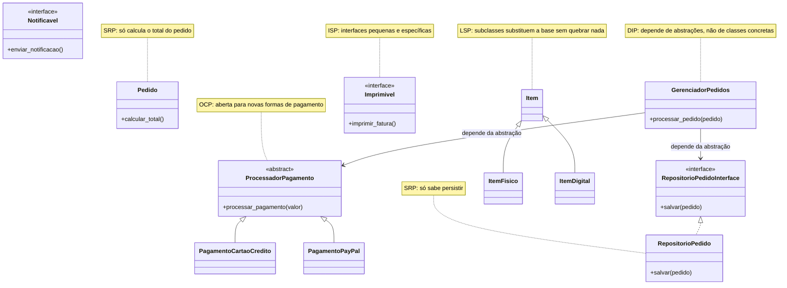
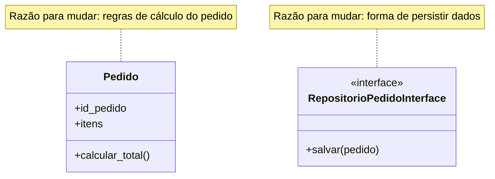
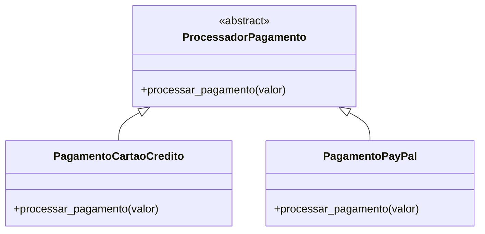
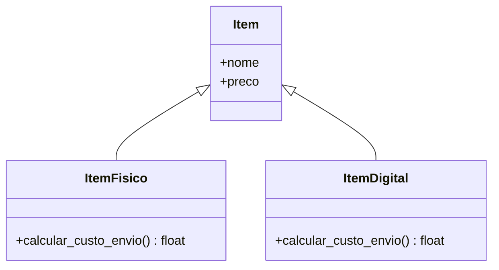
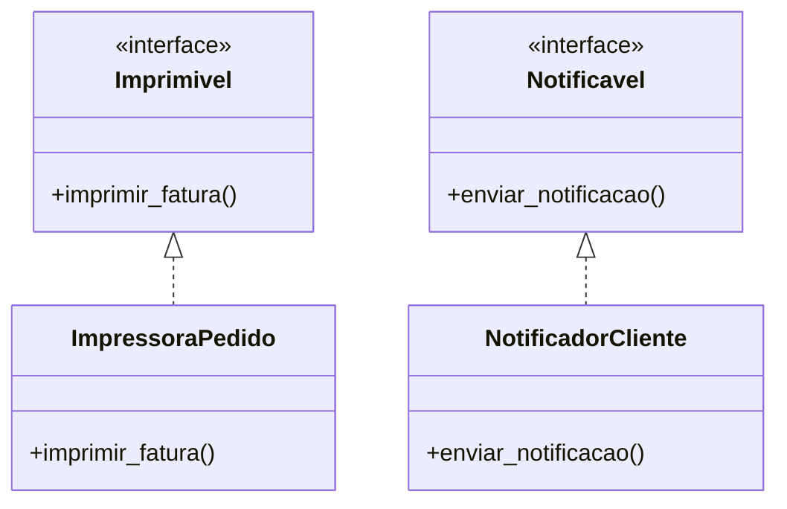
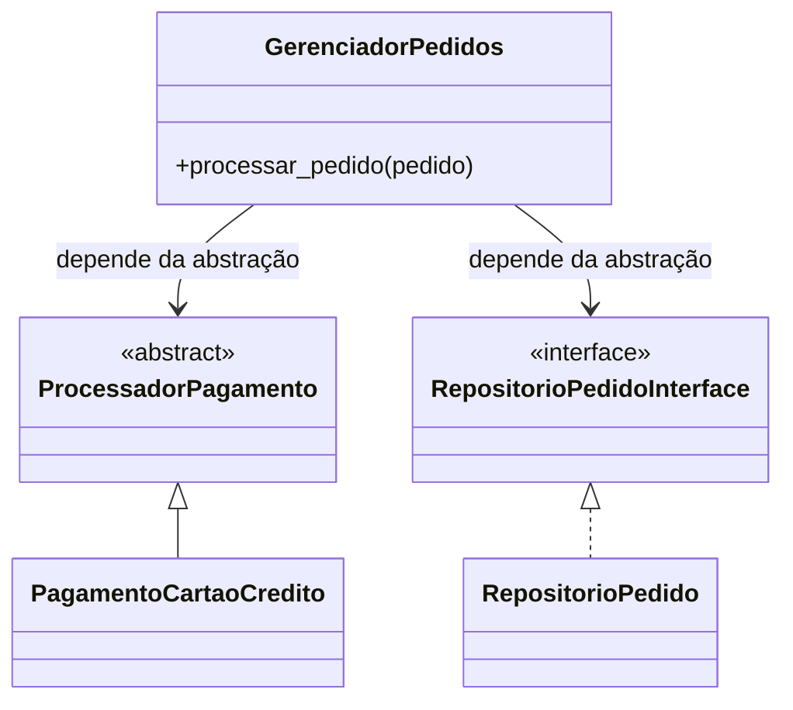

# Princípios SOLID

SOLID é um acrônimo para cinco diretrizes de design orientado a objetos, propostas por Robert C. Martin, que existem para responder a uma pergunta prática: quando um sistema cresce, o que separa um código que continua fácil de mudar de um código que vira um pântano a cada nova funcionalidade? As cinco letras nomeiam cinco respostas distintas para essa pergunta — responsabilidade única, aberto/fechado, substituição de Liskov, segregação de interfaces e inversão de dependência — e cada uma ataca uma forma diferente de acoplamento indesejado entre classes.

Este texto usa um único cenário do início ao fim: um sistema de gerenciamento de pedidos de uma loja online, em Python. A mesma classe `Pedido`, os mesmos itens, o mesmo fluxo de pagamento vão reaparecer nas cinco seções, cada uma olhando para um pedaço diferente do mesmo problema. Isso é proposital — SOLID não é cinco receitas independentes, é cinco lentes sobre o mesmo tipo de decisão: como desenhar os limites entre as classes.

O diagrama abaixo mostra onde cada princípio atua no sistema completo, para servir de mapa antes de entrar em cada um em detalhe.



---

## 1. Princípio da Responsabilidade Única (SRP)

Uma classe deve ter uma única razão para mudar. Na prática, isso significa perguntar, para cada classe: se este requisito específico mudasse, quais outras partes do sistema eu precisaria tocar? Se a resposta envolve razões de negócio completamente diferentes — por exemplo, "a regra de cálculo do pedido mudou" e "trocamos o banco de dados" — essas duas razões não deveriam morar na mesma classe. Dividir responsabilidades reduz o acoplamento, facilita a manutenção e evita que uma classe cresça até virar um ponto único onde qualquer mudança é arriscada.



```python
class Pedido:
    def __init__(self, id_pedido, itens):
        self.id_pedido = id_pedido
        self.itens = itens

    def calcular_total(self):
        return sum(item.preco for item in self.itens)


class RepositorioPedido:
    def salvar(self, pedido):
        print(f"Salvando pedido {pedido.id_pedido} no banco de dados")
```

No exemplo, `Pedido` responde apenas por dados e regras do pedido — ela sabe calcular o total, e nada além disso. A responsabilidade de persistência foi deliberadamente extraída para `RepositorioPedido`. O ganho concreto: se a forma de salvar mudar — trocar um banco relacional por um NoSQL, por exemplo — apenas `RepositorioPedido` é tocada; `Pedido` nunca precisa saber que essa mudança aconteceu.

## 2. Princípio Aberto/Fechado (OCP)

Uma classe deve estar aberta para extensão, mas fechada para modificação: deve ser possível adicionar comportamento novo sem alterar código que já foi escrito, testado e está em produção. Isso importa porque toda modificação em código existente é uma oportunidade de quebrar algo que já funcionava; adicionar uma classe nova, em vez de editar uma antiga, elimina esse risco.



```python
from abc import ABC, abstractmethod

class ProcessadorPagamento(ABC):
    @abstractmethod
    def processar_pagamento(self, valor):
        pass


class PagamentoCartaoCredito(ProcessadorPagamento):
    def processar_pagamento(self, valor):
        print(f"Processando pagamento de {valor} via cartão de crédito")


class PagamentoPayPal(ProcessadorPagamento):
    def processar_pagamento(self, valor):
        print(f"Processando pagamento de {valor} via PayPal")
```

A classe abstrata `ProcessadorPagamento` define o contrato — todo processador sabe `processar_pagamento` — sem impor como cada um faz isso. Para aceitar Pix amanhã, basta criar `PagamentoPix(ProcessadorPagamento)`; nenhuma linha de `PagamentoCartaoCredito` ou `PagamentoPayPal` precisa mudar.

## 3. Princípio da Substituição de Liskov (LSP)

Uma subclasse deve poder substituir sua superclasse em qualquer lugar do programa sem alterar o comportamento esperado. Isso vai além de apenas "herdar corretamente": significa que quem usa um `Item` genérico pode receber um `ItemFisico` ou um `ItemDigital` no lugar e continuar funcionando sem casos especiais. Quando uma subclasse exige que quem a chama saiba distinguir "este é o tipo especial que se comporta diferente", o princípio já foi violado.



```python
class Item:
    def __init__(self, nome, preco):
        self.nome = nome
        self.preco = preco


class ItemFisico(Item):
    def calcular_custo_envio(self):
        return 10.0  # Custo fixo de envio


class ItemDigital(Item):
    def calcular_custo_envio(self):
        return 0.0  # Produtos digitais não têm custo de envio
```

`ItemFisico` e `ItemDigital` herdam de `Item` e implementam `calcular_custo_envio` de forma consistente com o que a base promete: sempre retornam um número, sempre representam o custo de envio daquele item. Qualquer código que itere sobre uma lista de `Item` e chame `calcular_custo_envio()` funciona igual para os dois, sem precisar checar `isinstance`.

## 4. Princípio da Segregação de Interfaces (ISP)

Clientes não devem ser forçados a depender de métodos que não usam. Uma interface grande, que mistura responsabilidades não relacionadas, obriga cada classe que a implementa a carregar métodos que não fazem sentido para ela — geralmente resolvidos com `pass` ou `raise NotImplementedError`, o que é um sintoma de que a interface deveria ter sido dividida.



```python
from abc import ABC, abstractmethod

class Imprimivel(ABC):
    @abstractmethod
    def imprimir_fatura(self):
        pass


class Notificavel(ABC):
    @abstractmethod
    def enviar_notificacao(self):
        pass


class ImpressoraPedido(Imprimivel):
    def imprimir_fatura(self):
        print("Imprimindo fatura do pedido")


class NotificadorCliente(Notificavel):
    def enviar_notificacao(self):
        print("Enviando notificação ao cliente")
```

Em vez de uma única interface `ServicoDePedido` com `imprimir_fatura` e `enviar_notificacao` misturados, existem duas interfaces pequenas e específicas. `ImpressoraPedido` implementa só `Imprimivel`, `NotificadorCliente` implementa só `Notificavel` — nenhuma das duas é forçada a fingir que sabe fazer o que não faz.

## 5. Princípio da Inversão de Dependência (DIP)

Módulos de alto nível não devem depender de módulos de baixo nível; ambos devem depender de abstrações. "Alto nível" aqui é a classe que orquestra a regra de negócio — no exemplo, quem processa um pedido; "baixo nível" são os detalhes de como pagar e como persistir. Se a classe de orquestração depender diretamente de uma classe concreta, trocar essa classe concreta (por exemplo, trocar o banco de dados) obriga a alterar a orquestração também. Depender de uma abstração quebra esse acoplamento.

Vale notar que este é o único dos cinco princípios que exige uma abstração dos **dois** lados da dependência — e por isso `RepositorioPedido`, que na seção 1 apareceu como uma classe concreta comum, ganha aqui uma interface, `RepositorioPedidoInterface`, exatamente como `ProcessadorPagamento` já tinha desde a seção 2.



```python
class GerenciadorPedidos:
    def __init__(self, processador_pagamento: ProcessadorPagamento, repositorio: RepositorioPedidoInterface):
        self.processador_pagamento = processador_pagamento
        self.repositorio = repositorio

    def processar_pedido(self, pedido):
        total = pedido.calcular_total()
        self.processador_pagamento.processar_pagamento(total)
        self.repositorio.salvar(pedido)
```

`GerenciadorPedidos` conhece apenas os contratos `ProcessadorPagamento` e `RepositorioPedidoInterface`, nunca as classes concretas. Isso permite injetar `PagamentoCartaoCredito` ou `PagamentoPayPal`, `RepositorioPedido` ou qualquer outra implementação futura, sem mudar uma linha de `GerenciadorPedidos` — e é o que tornaria essa classe testável com um repositório falso em memória, sem precisar de um banco de dados real, se fosse necessário testá-la.

---

## Exemplo integrado

Juntando as cinco classes anteriores, o programa completo cria itens, monta um pedido, configura as dependências concretas e as injeta em `GerenciadorPedidos`:

```python
if __name__ == "__main__":
    # Criando itens
    livro = ItemFisico("Livro", 50.0)
    ebook = ItemDigital("E-book", 30.0)

    # Criando pedido
    pedido = Pedido(1, [livro, ebook])

    # Configurando dependências concretas, injetadas via abstrações (DIP)
    processador_pagamento = PagamentoCartaoCredito()
    repositorio = RepositorioPedido()
    impressora = ImpressoraPedido()
    notificador = NotificadorCliente()

    # Processando pedido
    gerenciador = GerenciadorPedidos(processador_pagamento, repositorio)
    gerenciador.processar_pedido(pedido)

    # Imprimindo e notificando
    impressora.imprimir_fatura()
    notificador.enviar_notificacao()

    # Calculando custos de envio
    print(f"Custo de envio do livro: {livro.calcular_custo_envio()}")
    print(f"Custo de envio do e-book: {ebook.calcular_custo_envio()}")
```

Este trecho corresponde exatamente a [`PDS/solid/main.py`](/PDS/solid/main.py) — pode ser executado com `python main.py` dentro da pasta `PDS/solid/` sem nenhuma dependência externa além do Python padrão.

## Onde isso aparece de novo

Os cinco princípios aqui não são um exercício isolado: [`PDS/mvc/mvc.md`](/PDS/mvc/mvc.md) mostra a mesma aplicação de pedidos rodando dentro de um MVC completo, com `PedidoService` e `IPedidoRepository` aplicando SRP e DIP a um Controller que, sem eles, misturaria acesso a banco, regra de negócio e chamada à view na mesma classe — a continuação natural de tudo o que foi explicado acima, agora dentro de uma arquitetura maior.
