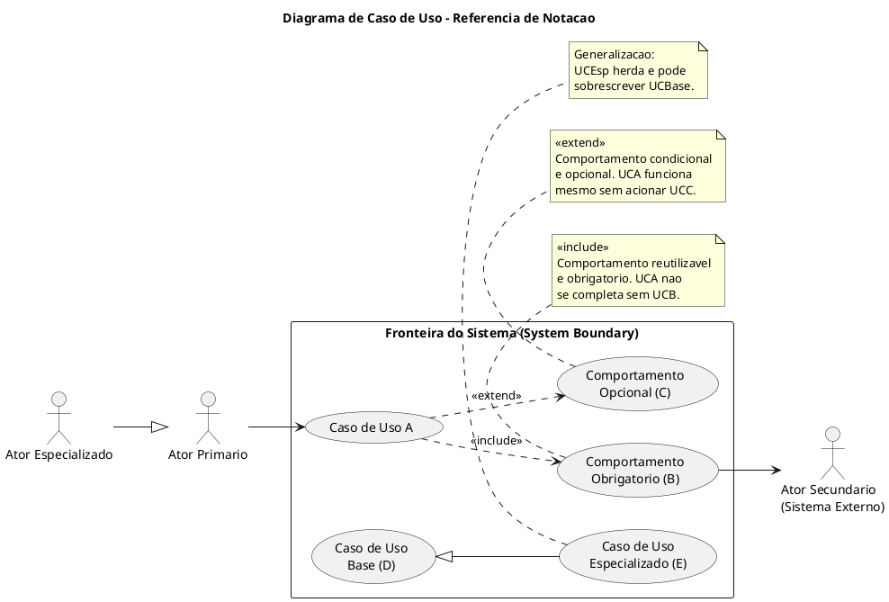
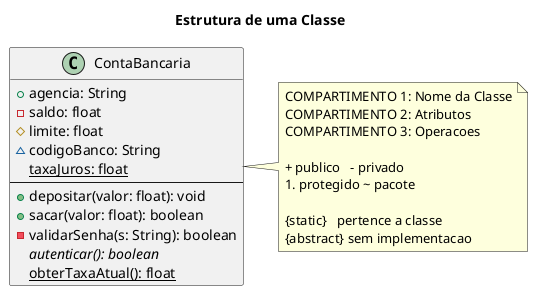
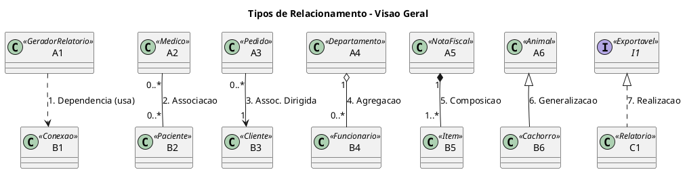
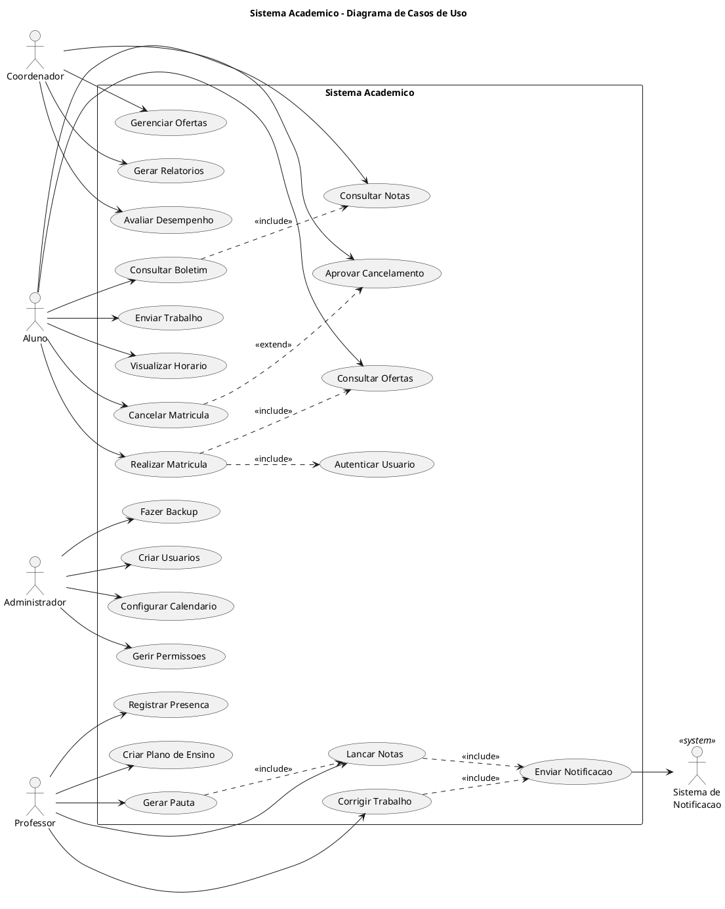

# UML: Diagramas de Caso de Uso e Diagrama de Classes

**Disciplina:** Engenharia de Software / Programacao Orientada a Objetos  
**Instituto:** IFB - Campus Valparaiso de Goias  
**Licenca:** CC BY-NC-SA 4.0

---

## 1. Introducao a UML

### 1.1 O que e UML

A **UML (Unified Modeling Language)** e uma linguagem de modelagem visual padronizada pelo **OMG (Object Management Group)** para especificacao, construcao, visualizacao e documentacao de artefatos de sistemas de software. A versao vigente e a UML 2.5.1, publicada em 2017.

A UML nao e uma metodologia de desenvolvimento nem uma linguagem de programacao. E uma **notacao grafica** que permite comunicar decisoes de design de forma precisa e nao ambigua entre engenheiros, arquitetos e demais stakeholders de um projeto.

> "A UML e a linguagem padrao da industria para especificar, visualizar, construir e documentar os artefatos de sistemas de software." — OMG UML Specification 2.5.1

### 1.2 Breve Historico

| Ano | Evento |
|-----|--------|
| 1994-1995 | Grady Booch, Ivar Jacobson e James Rumbaugh ("Tres Amigos") unificam Booch Method, OOSE e OMT |
| 1997 | OMG adota UML 1.0 como padrao internacional |
| 2005 | UML 2.0: reorganizacao dos diagramas, novos diagramas comportamentais |
| 2017 | UML 2.5.1 (versao atual): simplificacao do metamodelo, adocao ampla na industria |

### 1.3 Porque usar UML

- **Comunicacao**: permite que analistas, desenvolvedores e clientes discutam o sistema com uma linguagem visual comum
- **Documentacao**: registra decisoes de design que nao sao obvias no codigo fonte
- **Deteccao precoce de falhas**: inconsistencias e omissoes identificadas no diagrama custam uma fracao do custo de corrigi-las em producao
- **Base para codigo**: diagramas de classes bem construidos se traduzem diretamente em estrutura de codigo

### 1.4 Ferramentas

- **PlantUML** — definicao de diagramas como texto, integrado ao VS Code, IntelliJ e outros editores
- **Draw.io / diagrams.net** — ferramenta visual baseada em navegador, gratuita
- **StarUML** — editor dedicado a UML com suporte a engenharia reversa
- **Lucidchart** — colaborativo, baseado em nuvem
- **Enterprise Architect** — solucao comercial completa para projetos grandes

---

## 2. Categorias de Diagramas UML

A UML 2.5 define **14 tipos de diagramas**, organizados em duas grandes categorias.

### 2.1 Diagramas Estruturais

Descrevem a **estrutura estatica** do sistema: o que existe e como esta organizado.

| Diagrama | Foco Principal | Uso Tipico |
|---|---|---|
| **Classes** | Estrutura de classes, atributos, metodos, relacionamentos | Design detalhado de software OO |
| Objetos | Instancias concretas em um momento especifico | Exemplificar estados e snapshot do sistema |
| Componentes | Modulos de software e suas interfaces | Arquitetura de modulos e dependencias |
| Pacotes | Agrupamento logico de elementos UML | Organizacao de namespaces e modulos |
| Deployment | Distribuicao fisica de artefatos em nos de infraestrutura | Arquitetura de servidores e redes |
| Composite Structure | Estrutura interna de uma classe e colaboracoes | Padroes de design complexos |
| Profile | Extensoes do metamodelo UML para dominios especificos | DSLs e personalizacoes da linguagem |

### 2.2 Diagramas Comportamentais

Descrevem o **comportamento dinamico** do sistema: como ele age e reage ao longo do tempo.

| Diagrama | Foco Principal | Uso Tipico |
|---|---|---|
| **Caso de Uso** | Interacoes entre atores externos e o sistema | Levantamento e documentacao de requisitos |
| Atividade | Fluxo de controle e dados em um processo | Workflows, logica de negocio, algoritmos |
| Maquina de Estado | Ciclo de vida de um objeto atraves de estados | Entidades com comportamento dirigido por eventos |
| Sequencia | Troca de mensagens entre objetos ao longo do tempo | Detalhamento de cenarios e protocolos |
| Comunicacao | Colaboracao entre objetos com enfase nos links | Alternativa compacta ao diagrama de sequencia |
| Visao Geral de Interacao | Composicao de diagramas de interacao | Fluxos com subfluxos e ramificacoes complexas |
| Temporização | Restricoes de tempo entre estados | Sistemas embarcados e de tempo real |

Este documento aprofunda dois diagramas fundamentais para projeto de software orientado a objetos: **Caso de Uso** e **Classes**.

---

## 3. Diagrama de Caso de Uso

### 3.1 Finalidade e Escopo

O diagrama de caso de uso responde a pergunta central do levantamento de requisitos: **quem usa o sistema e para que?**

Ele modela o comportamento do sistema do ponto de vista externo, definindo:

- Os **atores** que interagem com o sistema (papeis, nao individuos)
- As **funcionalidades** que o sistema oferece (casos de uso)
- A **fronteira** que separa o que e do sistema e o que e externo a ele
- Os **relacionamentos** entre atores e funcionalidades

O diagrama de caso de uso **nao descreve** como o sistema funciona internamente. Ele e um contrato de escopo: define o que sera entregue e para quem, sem comprometer a implementacao.

### 3.2 Elementos da Notacao

**Arquivo:** [asset/diagrams/uc_elementos.puml](asset/diagrams/uc_elementos.puml)



#### Resumo dos Elementos

| Elemento | Notacao | Descricao |
|---|---|---|
| **Ator Primario** | Figura humana, a esquerda | Inicia a interacao para atingir um objetivo |
| **Ator Secundario** | Figura humana, a direita | Reage ou presta servico ao sistema |
| **Caso de Uso** | Elipse com nome no infinitivo | Funcionalidade que entrega valor ao ator |
| **Fronteira do Sistema** | Retangulo rotulado | Delimita o escopo do sistema modelado |
| **Associacao** | Linha solida | Ator participa do caso de uso |
| **Include** | Linha tracejada `<<include>>` | Caso de uso base sempre invoca o incluido |
| **Extend** | Linha tracejada `<<extend>>` | Caso de uso base invoca o extensor condicionalmente |
| **Generalizacao** | Seta com triangulo vazio | Heranca de comportamento entre atores ou entre casos de uso |

---

### 3.3 Relacionamentos em Detalhe

#### 3.3.1 Associacao

A **associacao** e o relacionamento mais simples: representa a participacao de um ator em um caso de uso.

- Representada por uma **linha solida**
- Nao tem direcao obrigatoria, mas convencionalmente o ator aponta para o caso de uso quando ele o inicia
- Quando um ator secundario (sistema externo) e chamado pelo sistema, o caso de uso aponta para o ator

```
Aluno ——> (Consultar Notas)
(Enviar Notificacao) ——> SistemaEmail
```

#### 3.3.2 Include

A relacao `<<include>>` modela a **reutilizacao de comportamento obrigatorio**.

- O caso de uso **base** delega parte de seu fluxo ao caso de uso **incluido**
- A execucao do incluido e **sempre obrigatoria** quando o base e invocado
- Tipicamente usada para extrair comportamentos comuns a multiplos casos de uso

**Direcao da seta:** do base para o incluido  
**Analogia:** chamada de funcao — o base sempre chama o incluido

```
(Realizar Matricula) ..> (Autenticar Usuario) : <<include>>
```

Interpretacao: sempre que "Realizar Matricula" e executado, "Autenticar Usuario" tambem e executado.

#### 3.3.3 Extend

A relacao `<<extend>>` modela **comportamento condicional e opcional**.

- O caso de uso **extensor** adiciona comportamento ao caso de uso **base** em um ponto de extensao
- A extensao so ocorre quando uma **condicao de guarda** e satisfeita
- O caso de uso base funciona normalmente mesmo que a extensao nao seja acionada

**Direcao da seta:** do extensor para o base  
**Analogia:** plugin ou hook — o base pode ou nao ser estendido

```
(Cancelar Matricula) ..> (Aprovar Cancelamento) : <<extend>>
```

Interpretacao: "Cancelar Matricula" pode, sob certas condicoes de negocio, acionar "Aprovar Cancelamento". O cancelamento pode tambem ser direto, sem aprovacao.

#### 3.3.4 Comparacao Include versus Extend

| Criterio | `<<include>>` | `<<extend>>` |
|---|---|---|
| Obrigatoriedade | Sempre executado | Executado sob condicao |
| Dependencia | Base depende do incluido | Base e independente do extensor |
| Iniciativa | O base invoca o incluido | O extensor decide acionar o base |
| Direcao da seta | Base -> Incluido | Extensor -> Base |
| Analogia | Chamada de funcao obrigatoria | Middleware ou plugin condicional |
| Uso tipico | Comportamentos reutilizados em varios UC | Comportamentos opcionais ou excepcionais |

#### 3.3.5 Generalizacao entre Atores

Um ator pode especializar outro, herdando todas as suas associacoes.

```
Professor --|> Usuario
Administrador --|> Usuario
```

O ator especializado herda todos os casos de uso do ator generico e pode ter casos de uso adicionais exclusivos.

#### 3.3.6 Generalizacao entre Casos de Uso

Um caso de uso pode especializar outro, herdando seu fluxo basico e substituindo ou adicionando passos.

```
(Realizar Matricula Prioritaria) <|-- (Realizar Matricula)
```

Diferente de `<<extend>>`, a generalizacao representa uma variante completa, nao apenas uma adicao condicional.

---

### 3.4 Especificacao Textual de um Caso de Uso

O diagrama grafico e apenas o mapa. Cada elipse deve ser acompanhada de uma **especificacao textual estruturada** que detalha o fluxo com precisao suficiente para implementacao e testes.

Template padrao:

| Campo | Conteudo |
|---|---|
| **Identificador** | Codigo unico (ex.: UC-03) |
| **Nome** | Verbo no infinitivo que descreve o objetivo do ator |
| **Atores** | Lista dos atores primarios e secundarios envolvidos |
| **Pre-condicoes** | Estado do sistema necessario para iniciar o caso de uso |
| **Fluxo Principal** | Sequencia numerada de passos no cenario de sucesso |
| **Fluxo Alternativo** | Variantes do fluxo principal (caminhos secundarios validos) |
| **Fluxo de Excecao** | Tratamento de erros e condicoes anormais |
| **Pos-condicoes** | Estado do sistema apos a execucao bem-sucedida |
| **Regras de Negocio** | Restricoes e invariantes que governam o caso de uso |

**Exemplo:** Especificacao de "Realizar Matricula"

| Campo | Conteudo |
|---|---|
| **Identificador** | UC-01 |
| **Nome** | Realizar Matricula |
| **Atores** | Aluno (primario) |
| **Pre-condicoes** | Aluno autenticado no sistema; periodo de matriculas aberto no calendario |
| **Fluxo Principal** | 1. Aluno consulta ofertas de disciplinas disponíveis  2. Sistema exibe turmas com vagas  3. Aluno seleciona uma turma  4. Sistema valida pre-requisitos e disponibilidade  5. Sistema registra a matricula e reduz o contador de vagas  6. Sistema confirma a operacao ao aluno |
| **Fluxo Alternativo** | 3a. Nenhuma turma disponivel: sistema exibe mensagem e encerra |
| **Fluxo de Excecao** | 4a. Pre-requisitos nao cumpridos: sistema bloqueia e informa os requisitos faltantes |
| **Pos-condicoes** | Matricula registrada com status "confirmada"; vaga descontada da turma |
| **Regras de Negocio** | RN-01: Maximo de 6 disciplinas por periodo; RN-02: Colisao de horarios nao permitida |

---

### 3.5 Boas Praticas no Diagrama de Caso de Uso

**Nomenclatura:**
- Nomeie casos de uso com verbos no infinitivo que expressem o objetivo do ator, nao acoes do sistema: "Consultar Extrato" e melhor que "ExibirDadosExtrato"
- Nomeie atores pelo papel (funcao no contexto do sistema), nao pelo cargo: "Aprovador" em vez de "Gerente de Credito"

**Escopo:**
- Mantenha o diagrama no nivel de negocio, nao de implementacao. "Autenticar Usuario" e um caso de uso valido; "Validar Token JWT" e detalhe de implementacao
- Evite casos de uso que representem passos internos do sistema sem valor direto ao ator (ex.: "Salvar no Banco de Dados")

**Relacionamentos:**
- Use `<<include>>` para comportamentos que ocorrem em varios casos de uso (DRY: Don't Repeat Yourself)
- Use `<<extend>>` com parcimonia. Muitas extensoes indicam que o caso de uso base e demasiadamente generico
- Evite cadeias longas de include ou extend; elas obscurecem o fluxo

**Volume:**
- Um diagrama com mais de 20 casos de uso costuma perder clareza. Considere subdividir por subsistema
- Inclua apenas os atores que realmente interagem com o sistema; excluir atores internos (DBA, Servidor) que nao sao papeis de negocio

---

## 4. Diagrama de Classes

### 4.1 Finalidade

O diagrama de classes modela a **estrutura estatica** do sistema orientado a objetos:

- As **classes** que existem no sistema
- Os **atributos** e **metodos** de cada classe
- Os **relacionamentos** entre classes
- As **restricoes** e **invariantes** do modelo

E o diagrama mais utilizado para traduzir requisitos em design e o design em codigo. Um diagrama de classes bem construido mapeia diretamente para a estrutura de modulos, pacotes e arquivos do projeto.

### 4.2 Anatomia de uma Classe

**Arquivo:** [asset/diagrams/cls_elementos.puml](asset/diagrams/cls_elementos.puml)



#### 4.2.1 Compartimentos

Uma classe e dividida em ate tres compartimentos separados por linhas horizontais:

1. **Nome**: identificador da classe, em negrito, centralizado. Classes abstratas aparecem em italico ou com o estereotipo `<<abstract>>`
2. **Atributos**: lista de atributos no formato `visibilidade nome : tipo [= valorPadrao]`
3. **Operacoes**: lista de metodos no formato `visibilidade nome(parametros) : tipoRetorno`

#### 4.2.2 Modificadores de Visibilidade

| Simbolo | Nome | Acessivel por |
|---|---|---|
| `+` | Publico | Qualquer classe |
| `-` | Privado | Apenas a propria classe |
| `#` | Protegido | A classe e suas subclasses |
| `~` | Pacote | Classes do mesmo pacote/modulo |

#### 4.2.3 Modificadores de Escopo e Natureza

| Notacao | Significado | Representacao visual |
|---|---|---|
| `{static}` | Pertence a classe, nao ao objeto | Texto sublinhado |
| `{abstract}` | Sem implementacao na classe atual | Texto em italico |

#### 4.2.4 Tipos de Dados

Em UML, tipos sao independentes de linguagem. Use tipos descritivos:

| UML | Python | Java |
|---|---|---|
| `String` | `str` | `String` |
| `Integer` | `int` | `int` / `Integer` |
| `Float` | `float` | `double` / `float` |
| `Boolean` | `bool` | `boolean` |
| `Date` | `datetime` | `LocalDate` |
| `List<T>` | `list[T]` | `List<T>` |
| `Map<K,V>` | `dict[K, V]` | `Map<K,V>` |

---

### 4.3 Multiplicidade

A multiplicidade especifica **quantas instancias** de uma classe podem se associar a instancias de outra classe.

| Notacao | Significado |
|---|---|
| `1` | Exatamente uma instancia |
| `0..1` | Zero ou uma instancia (opcional) |
| `*` ou `0..*` | Zero ou mais instancias |
| `1..*` | Uma ou mais instancias |
| `n` | Exatamente n instancias |
| `m..n` | Entre m e n instancias |

**Exemplo de leitura:**

```
Turma "1" *-- "0..*" Matricula
```

Leitura: Uma turma possui zero ou mais matriculas. Cada matricula pertence a exatamente uma turma.

A multiplicidade e colocada nas **extremidades** da linha de relacionamento, proxima a cada classe participante.

---

### 4.4 Tipos de Relacionamento

**Arquivo:** [asset/diagrams/cls_relacionamentos.puml](asset/diagrams/cls_relacionamentos.puml)

Os sete tipos de relacionamento, em ordem crescente de acoplamento:



#### 4.4.1 Dependencia (`A ..> B`)

**Semantica:** A usa B de forma temporaria (como parametro, variavel local ou tipo de retorno). A mudanca na interface de B pode quebrar A.

**Acoplamento:** o mais fraco.

```
GeradorRelatorio ..> Conexao : usa
```

#### 4.4.2 Associacao (`A -- B`)

**Semantica:** A e B se conhecem mutuamente. Ambos mantem referencia um ao outro. O relacionamento e persistente (nao apenas temporario como a dependencia).

**Acoplamento:** fraco a moderado.

```
Medico "0..*" -- "0..*" Paciente : atende
```

#### 4.4.3 Associacao Dirigida (`A --> B`)

**Semantica:** A conhece e navega ate B, mas B nao tem referencia a A. A seta indica a direcao de navegacao.

**Acoplamento:** moderado.

```
Pedido "0..*" --> "1" Cliente : pertence a
```

#### 4.4.4 Agregacao (`A o-- B`)

**Semantica:** B e parte de A, mas pode existir de forma independente de A. Ciclos de vida **distintos**. Representada pelo diamante vazio na extremidade do todo.

**Regra pratica:** se destruir A nao implica destruir B, use agregacao.

```
Departamento "1" o-- "0..*" Funcionario : emprega
```

Um funcionario pode ser transferido de departamento; existe antes e apos o departamento.

#### 4.4.5 Composicao (`A *-- B`)

**Semantica:** B e parte essencial de A e nao pode existir sem ele. Ciclos de vida **compartilhados**. Representada pelo diamante cheio na extremidade do todo.

**Regra pratica:** se destruir A implica destruir B, use composicao.

```
NotaFiscal "1" *-- "1..*" ItemNF : contem
```

Um item de nota fiscal nao tem sentido fora da sua nota.

#### 4.4.6 Generalizacao / Heranca (`SuperClasse <|-- SubClasse`)

**Semantica:** SubClasse e um tipo especializado de SuperClasse. Herda todos os atributos e operacoes publicos e protegidos. Relacao "e um" (is-a).

```
Animal <|-- Cachorro
Animal <|-- Gato
```

O triangulo vazio aponta sempre para a **superclasse**.

#### 4.4.7 Realizacao / Interface (`Interface <|.. Classe`)

**Semantica:** Classe se compromete a implementar o contrato definido pela Interface. Todos os metodos abstratos da interface devem ser concretizados.

```
Exportavel <|.. Relatorio
```

A linha tracejada com triangulo vazio distingue a realizacao da heranca solida.

#### 4.4.8 Tabela Comparativa

| Tipo | Notacao | Destruir A destroi B? | B existe sem A? | Direcao |
|---|---|---|---|---|
| Dependencia | `..>` | N/A | N/A | Unidirecional |
| Associacao | `--` | Nao | Sim | Bidirecional |
| Assoc. Dirigida | `-->` | Nao | Sim | Unidirecional |
| Agregacao | `o--` | Nao | Sim | Unidirecional |
| Composicao | `*--` | Sim | Nao | Unidirecional |
| Generalizacao | `<|--` | N/A | N/A | Superclasse <- Subclasse |
| Realizacao | `<|..` | N/A | N/A | Interface <- Classe |

---

### 4.5 Classes Abstratas e Interfaces

#### Classes Abstratas

Uma **classe abstrata** define atributos e operacoes comuns que subclasses devem herdar, mas nao pode ser instanciada diretamente. Ela pode conter tanto metodos concretos (com implementacao) quanto metodos abstratos (sem implementacao).

Em UML:
- O nome aparece em _italico_
- Metodos abstratos aparecem em _italico_
- Estereotipo `<<abstract>>` pode ser adicionado ao compartimento do nome

```python
# Python correspondente
from abc import ABC, abstractmethod

class Usuario(ABC):
    def __init__(self, nome: str):
        self._nome = nome

    @abstractmethod
    def autenticar(self, senha: str) -> bool:
        pass

    def atualizar_perfil(self) -> None:
        pass  # implementacao concreta herdada
```

#### Interfaces

Uma **interface** e um contrato puro: define somente assinaturas de operacoes, sem nenhum atributo de instancia e sem implementacao. Em linguagens como Python (via `Protocol` ou `ABC`), Java e C#, interfaces garantem que classes nao relacionadas por heranca compartilhem o mesmo comportamento.

Em UML:
- Indicada pelo estereotipo `<<interface>>` no compartimento do nome
- Todos os metodos sao implicitamente publicos e abstratos
- Realizada por classes com a relacao `<|..`

```python
# Python: interface via ABC
from abc import ABC, abstractmethod

class Exportavel(ABC):
    @abstractmethod
    def exportar_csv(self) -> str:
        pass

    @abstractmethod
    def exportar_json(self) -> str:
        pass
```

---

### 4.6 Estereotipos e Notas

**Estereotipos** estendem a semantica de elementos UML para representar conceitos especificos do dominio ou da tecnologia:

```
<<entity>>     — classe que representa dado persistido
<<boundary>>   — classe de interface com o usuario ou sistema externo
<<control>>    — classe que orquestra logica de negocio
<<service>>    — componente sem estado que presta servico
<<repository>> — responsavel pelo acesso a dados
```

**Notas** sao comentarios anexados a elementos do diagrama. Usadas para:
- Documentar restricoes que a notacao nao expressa
- Adicionar informacoes de implementacao relevantes
- Registrar decisoes de design

```plantuml
class Matricula {
    - status: String
}
note right of Matricula
  Valores validos de status:
  "pendente", "confirmada",
  "cancelada", "trancada"
end note
```

---

### 4.7 Boas Praticas no Diagrama de Classes

**Design das classes:**
- Cada classe deve ter uma **unica responsabilidade** (SRP — Single Responsibility Principle). Uma classe que faz logica de negocio, acesso a banco e formatacao de relatorio viola SRP
- Atributos devem ser **privados** por padrao (`-`). Exponha apenas o necessario atraves de metodos
- Prefira **composicao a heranca** quando a relacao nao for claramente "e um". Heranca cria acoplamento forte

**Relacionamentos:**
- Prefira **associacao dirigida** a associacao bidirecional. Dependencias unidirecionais sao mais faceis de manter e testar
- Use **composicao** quando a existencia de B depender exclusivamente de A
- Use **agregacao** quando B puder ter vida propria ou pertencer a varios A ao mesmo tempo
- Evite dependencias circulares entre classes (A depende de B que depende de A)

**Nomenclatura:**
- Nomes de classes: substantivos no singular, `PascalCase` (`ContaBancaria`, nao `contas`)
- Atributos: substantivos, `camelCase` (`dataMatricula`, nao `data_matricula` se seguir Java/UML padrao)
- Metodos: verbos, `camelCase` (`calcularJuros()`, `obterSaldo()`)
- Associacoes: verbos ou substantivos que descrevam o papel do relacionamento

**Nivel de abstracao:**
- O diagrama de classes e um modelo, nao uma listagem exaustiva do codigo. Omita detalhes de implementacao que nao contribuem para o entendimento da arquitetura
- Inclua apenas atributos e metodos que sao relevantes para o relacionamento com outras classes ou para a compreensao do papel da classe no sistema

---

## 5. Exemplo Integrado: Sistema Academico

### 5.1 Descricao do Dominio

O sistema academico gerencia a vida escolar de alunos e docentes em uma instituicao de ensino. As entidades principais sao:

- **Aluno**: discente com historico de frequencia, notas e matriculas
- **Professor**: docente que ministra turmas, registra presencas e lanca notas
- **Coordenador**: supervisiona a oferta de disciplinas e o desempenho coletivo
- **Administrador**: gerencia usuarios, calendario e infraestrutura do sistema
- **Turma**: instancia de uma disciplina em um periodo, com horario, sala e professor
- **Disciplina**: definicao curricular de uma materia (ementa, carga horaria, creditos)
- **Matricula**: vinculo entre aluno e turma em um periodo
- **Nota**: registro avaliativo de um aluno em uma turma
- **Trabalho**: entrega avaliativa submetida pelo aluno
- **Plano de Ensino**: documento pedagogico associado a uma turma

Este dominio e o mesmo implementado em [asset/code/chamada/](asset/code/chamada/), onde as classes `Aluno`, `Professor` e `Turma` formam o nucleo do sistema de controle de frequencia.

---

### 5.2 Diagrama de Caso de Uso

**Arquivo:** [asset/diagrams/sistema_academico.puml](asset/diagrams/sistema_academico.puml)



**Analise do diagrama:**

- `Autenticar Usuario` e incluido por `Realizar Matricula` pois toda matricula exige sessao valida. Poderia igualmente ser incluido por todos os casos de uso que requerem autenticacao
- `Consultar Boletim` inclui `Consultar Notas` porque o boletim e uma visao agregada das notas; a logica de consulta de notas e reutilizada
- `Cancelar Matricula` estende `Aprovar Cancelamento`: em alguns casos a regra de negocio exige aprovacao do coordenador; em outros, o cancelamento e direto
- `Sistema de Notificacao` e um ator secundario (sistema externo): o sistema academico o aciona, nao o contrario

---

### 5.3 Diagrama de Classes

**Arquivo:** [asset/diagrams/cls_sistema_academico.puml](asset/diagrams/cls_sistema_academico.puml)

```plantuml
@startuml cls_sistema_academico
title Sistema Academico - Diagrama de Classes
skinparam classAttributeIconSize 0

package "Usuarios" {
    abstract class Usuario {
        - id: int
        - nome: String
        - email: String
        - senhaHash: String
        - ativo: boolean
        --
        + {abstract} autenticar(senha: String): boolean
        + atualizarPerfil(): void
    }

    class Aluno {
        - matriculaAcademica: String
        - presencas: List<String>
        --
        + adicionarPresenca(data: String): void
        + consultarFrequencia(): String
        + consultarBoletim(): List<Nota>
        + enviarTrabalho(turma: Turma, arquivoPath: String): Trabalho
        + autenticar(senha: String): boolean
    }

    class Professor {
        - idProfessor: String
        - titulacao: String
        --
        + registrarPresenca(aluno: Aluno, turma: Turma, data: String): void
        + lancarNota(aluno: Aluno, tipo: String, valor: float): Nota
        + corrigirTrabalho(trabalho: Trabalho, nota: float): void
        + criarPlanoEnsino(turma: Turma): PlanoEnsino
        + gerarPauta(turma: Turma): List<Nota>
        + autenticar(senha: String): boolean
    }

    class Coordenador {
        - setor: String
        --
        + gerenciarOfertas(disciplina: Disciplina): Turma
        + aprovarCancelamento(matricula: Matricula): void
        + gerarRelatorio(): String
        + autenticar(senha: String): boolean
    }

    class Administrador {
        - nivelAcesso: int
        --
        + criarUsuario(dados: Map): Usuario
        + configurarCalendario(calendario: Calendario): void
        + gerirPermissoes(usuario: Usuario, permissao: String): void
        + fazerBackup(): void
        + autenticar(senha: String): boolean
    }

    Usuario <|-- Aluno
    Usuario <|-- Professor
    Usuario <|-- Coordenador
    Usuario <|-- Administrador
}

package "Academico" {
    class Disciplina {
        - codigo: String
        - nome: String
        - ementa: String
        - cargaHoraria: int
        - creditos: int
        --
        + obterTurmas(): List<Turma>
    }

    class Turma {
        - codigo: String
        - periodo: String
        - vagas: int
        - horario: String
        - sala: String
        - alunos: List<Aluno>
        --
        + matricularAluno(aluno: Aluno): void
        + removerAluno(aluno: Aluno): void
        + atualizarProfessor(professor: Professor): void
        + listarFrequencia(): String
        + estaDisponivel(): boolean
        + calcularMediaTurma(): float
    }

    class Matricula {
        - dataMatricula: Date
        - status: String
        --
        + cancelar(): void
        + confirmar(): void
    }

    class Nota {
        - tipo: String
        - valor: float
        - dataLancamento: Date
        --
        + validar(): boolean
        + corrigir(novoValor: float): void
    }

    class Trabalho {
        - titulo: String
        - arquivoPath: String
        - dataSubmissao: Date
        - notaAtribuida: float
        --
        + submeter(): void
        + corrigir(nota: float, feedback: String): void
    }

    class PlanoEnsino {
        - objetivos: String
        - metodologia: String
        - cronograma: String
        - bibliografia: String
        --
        + publicar(): void
        + atualizar(): void
    }
}

package "Suporte" {
    class Calendario {
        - anoLetivo: int
        - inicioSemestre: Date
        - fimSemestre: Date
        - inicioMatriculas: Date
        - fimMatriculas: Date
        --
        + matriculasAbertas(): boolean
        + periodoAtivo(): boolean
    }

    class Notificacao {
        - tipo: String
        - titulo: String
        - mensagem: String
        - dataEnvio: Date
        - lida: boolean
        --
        + marcarComoLida(): void
        + enviar(): void
    }
}

Disciplina "1" *-- "0..*" Turma : origina
Professor "1" --> "0..*" Turma : leciona
Coordenador "1" --> "0..*" Turma : supervisiona
Turma "1" *-- "0..*" Matricula : registra
Aluno "1" --> "0..*" Matricula : realiza
Turma "1" --> "0..*" Nota : possui
Aluno "1" --> "0..*" Nota : recebe
Professor "1" --> "0..*" Nota : lanca
Turma "1" *-- "0..*" Trabalho : recebe
Aluno "1" --> "0..*" Trabalho : submete
Turma "1" *-- "1" PlanoEnsino : possui
Usuario "1" o-- "0..*" Notificacao : recebe
@enduml
```



---

### 5.4 Rastreabilidade: Casos de Uso para Classes

A tabela abaixo mapeia os casos de uso do diagrama para as classes responsaveis por sua realizacao:

| Caso de Uso | Classe Orquestradora | Classes Colaboradoras |
|---|---|---|
| Realizar Matricula | `Aluno` | `Turma`, `Matricula`, `Calendario` |
| Consultar Boletim | `Aluno` | `Nota`, `Turma` |
| Registrar Presenca | `Professor` | `Aluno`, `Turma` |
| Lancar Notas | `Professor` | `Nota`, `Turma`, `Notificacao` |
| Corrigir Trabalho | `Professor` | `Trabalho`, `Notificacao` |
| Criar Plano de Ensino | `Professor` | `PlanoEnsino`, `Turma` |
| Gerar Pauta | `Professor` | `Nota`, `Turma` |
| Gerenciar Ofertas | `Coordenador` | `Disciplina`, `Turma` |
| Aprovar Cancelamento | `Coordenador` | `Matricula` |
| Configurar Calendario | `Administrador` | `Calendario` |

**Analise dos relacionamentos:**

- A composicao `Disciplina *-- Turma` reflete a regra de negocio: uma turma nao existe sem estar associada a uma disciplina curricular
- A composicao `Turma *-- Matricula` expressa que uma matricula perde sentido sem a turma a qual se refere; ao encerrar ou cancelar uma turma, as matriculas associadas sao igualmente afetadas
- A agregacao `Usuario o-- Notificacao` e intencional: notificacoes podem ser arquivadas e consultadas mesmo que o usuario mude de papel no sistema; o ciclo de vida nao e estritamente dependente

---

## 6. Referencias

### Especificacoes e Padroes

- OMG UML Specification 2.5.1: https://www.omg.org/spec/UML/
- ISO/IEC 19505-1:2012 — Information technology: Object Management Group UML

### Livros

- FOWLER, Martin. **UML Essencial** (UML Distilled). 3. ed. Addison-Wesley, 2004.
- JACOBSON, Ivar; BOOCH, Grady; RUMBAUGH, James. **The Unified Software Development Process**. Addison-Wesley, 1999.
- LARMAN, Craig. **Utilizando UML e Padroes**. 3. ed. Bookman, 2007.
- MARTIN, Robert C. **Clean Architecture**. Prentice Hall, 2017.

### Ferramentas

- PlantUML: https://plantuml.com
- Draw.io: https://www.drawio.com
- StarUML: https://staruml.io

### Arquivos de Diagrama (este repositorio)

| Arquivo | Conteudo |
|---|---|
| [asset/diagrams/uc_elementos.puml](asset/diagrams/uc_elementos.puml) | Referencia de notacao do diagrama de caso de uso |
| [asset/diagrams/sistema_academico.puml](asset/diagrams/sistema_academico.puml) | Diagrama de caso de uso do sistema academico |
| [asset/diagrams/cls_elementos.puml](asset/diagrams/cls_elementos.puml) | Referencia de notacao do diagrama de classes |
| [asset/diagrams/cls_relacionamentos.puml](asset/diagrams/cls_relacionamentos.puml) | Catalogo de todos os tipos de relacionamento |
| [asset/diagrams/cls_sistema_academico.puml](asset/diagrams/cls_sistema_academico.puml) | Diagrama de classes do sistema academico |
| [asset/code/chamada/](asset/code/chamada/) | Implementacao Python das classes Aluno, Professor e Turma |
