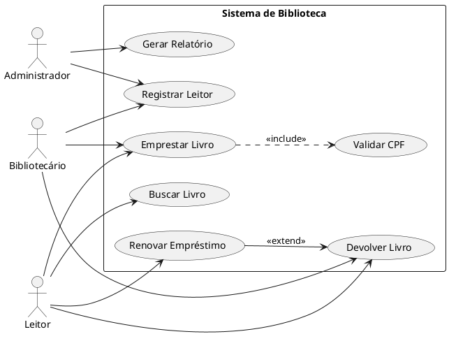
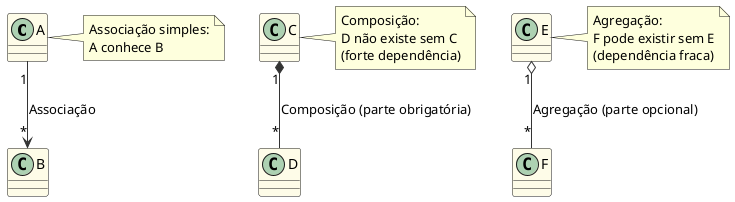
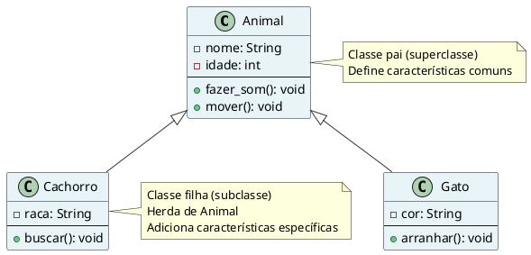
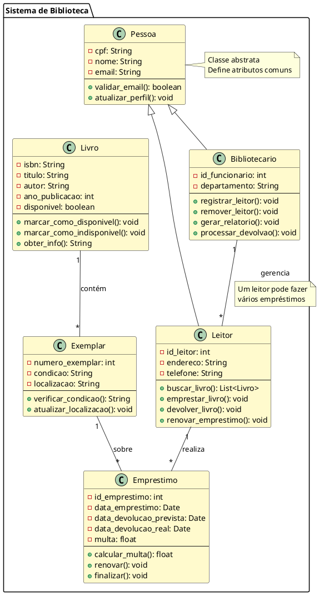
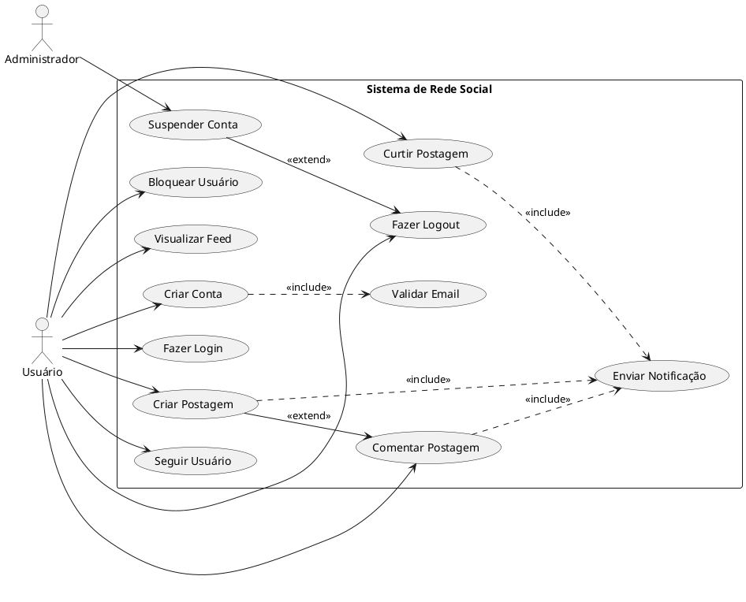
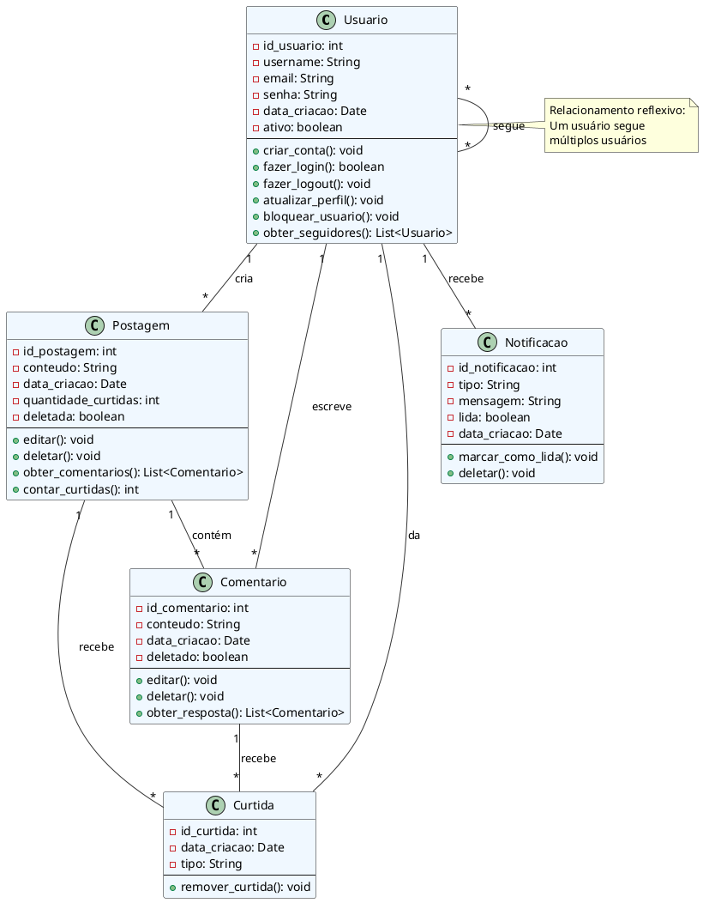
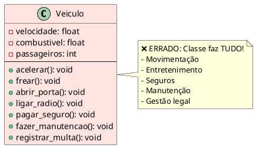
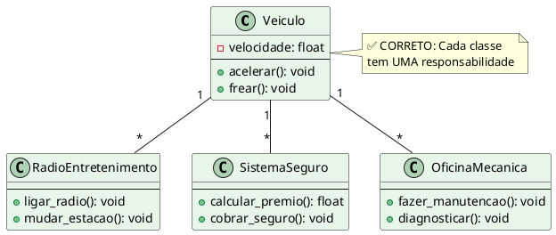
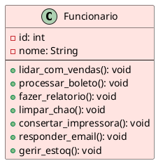

# UML: Diagramas de Caso de Uso e Classe

## 📚 Introdução

**UML (Unified Modeling Language)** é uma linguagem gráfica padronizada para modelagem de sistemas de software. Ela fornece notações visuais que facilitam a comunicação entre designers, desenvolvedores e stakeholders.

> "A UML permite que você visualize, especifique, construa e documente os artefatos de um sistema de software intensivo em software." — OMG (Object Management Group)

### Por que usar UML?

- ✅ **Comunicação clara** entre equipes multidisciplinares
- ✅ **Documentação visual** do sistema antes da codificação
- ✅ **Identificação de problemas** em fase de design
- ✅ **Reutilização de padrões** e arquitetura
- ✅ **Facilita manutenção** e evolução do código

---

## 📊 Tipos Principais de Diagramas UML

| Tipo | Propósito | Quando Usar |
|------|----------|-----------|
| **Caso de Uso** | Comportamento do sistema do ponto de vista do usuário | Fase de requisitos e escopo |
| **Classe** | Estrutura estática: classes, atributos, relacionamentos | Design detalhado |
| **Sequência** | Interação temporal entre objetos | Fluxos e protocolos |
| **Atividade** | Fluxo de processos e workflows | Lógica de negócio |
| **Estado** | Mudanças de estado de um objeto | Máquinas de estado |
| **Componente** | Componentes de software e dependências | Arquitetura |
| **Deployment** | Distribuição física do sistema | Infraestrutura |

---

## 1️⃣ Diagrama de Caso de Uso

### O que é?

Um **diagrama de caso de uso** modela o comportamento externo do sistema, descrevendo **quem** (ator) interage **com quê** (caso de uso) e **por quê** (objetivo).

### Elementos Principais

```
┌─────────────────────────────────────────────────────────┐
│  DIAGRAMA DE CASO DE USO - Elementos Básicos           │
├─────────────────────────────────────────────────────────┤
│                                                           │
│  ATOR (Actor):                                           │
│    👤  Representa um papel de usuário ou sistema         │
│                                                           │
│  CASO DE USO (Use Case):                                 │
│    (elipse)  Funcionalidade/tarefa que o sistema faz    │
│                                                           │
│  SISTEMA (System):                                       │
│    [retângulo] Delimita o escopo do sistema             │
│                                                           │
│  RELACIONAMENTOS:                                        │
│    ──→  Associação (ator participa do caso de uso)      │
│    ▷──  Include (caso de uso necessário/obrigatório)    │
│    ◁──  Extend (caso de uso opcional/condicional)       │
│                                                           │
└─────────────────────────────────────────────────────────┘
```

### Exemplo 1: Sistema de Biblioteca



### Descrevendo um Caso de Uso

Cada caso de uso deve ter uma descrição em **formato estruturado**:

#### Exemplo: Caso de Uso "Emprestar Livro"

| Atributo | Descrição |
|----------|-----------|
| **ID** | UC02 |
| **Nome** | Emprestar Livro |
| **Atores** | Leitor, Bibliotecário |
| **Pré-condição** | Leitor cadastrado; Livro disponível |
| **Fluxo Principal** | 1. Leitor solicita livro<br>2. Bibliotecário valida CPF<br>3. Sistema registra empréstimo<br>4. Sistema gera recibo |
| **Fluxo Alternativo** | Se livro indisponível: mostrar outras obras similares |
| **Pós-condição** | Empréstimo registrado; Livro marcado como indisponível |
| **Restrições** | Máximo 3 livros por leitor |

---

## 2️⃣ Diagrama de Classes

### O que é?

Um **diagrama de classes** mostra a estrutura estática do sistema, incluindo:
- **Classes** e seus atributos
- **Métodos** (operações)
- **Relacionamentos** entre classes (herança, composição, agregação)

### Elementos Principais

#### 1. Estrutura de uma Classe

```
┌─────────────────┐
│  Livro          │  ← Nome da classe
├─────────────────┤
│ - isbn: String  │  ← Atributos (dados)
│ - titulo: String│     (- privado, # protegido, + público)
│ - autor: String │
├─────────────────┤
│ + emprestar()   │  ← Métodos (comportamentos)
│ + devolver()    │
│ + renovar()     │
└─────────────────┘
```

#### 2. Modificadores de Acesso

| Símbolo | Significado | Acesso |
|---------|------------|--------|
| **+** | Público | Qualquer classe |
| **-** | Privado | Apenas a própria classe |
| **#** | Protegido | Classe e subclasses |
| **~** | Pacote | Apenas classes do mesmo pacote |

#### 3. Relacionamentos



#### 4. Herança (Generalização)



### Exemplo Completo: Sistema de Gerenciamento de Biblioteca



### Análise da Estrutura

**O que este diagrama nos mostra:**

1. **Herança**: Leitor e Bibliotecário herdam de Pessoa
2. **Associações**:
   - Leitor realiza múltiplos Empréstimos (1 para *)
   - Livro contém múltiplos Exemplares (1 para *)
   - Exemplar participa de múltiplos Empréstimos (1 para *)
3. **Responsabilidades**:
   - Pessoa: dados pessoais
   - Leitor: buscar e emprestar livros
   - Livro: informações bibliográficas
   - Exemplar: dados físicos do livro
   - Empréstimo: controle de datas e multas

---

## 3️⃣ Exemplo Integrado: Sistema de Rede Social

### Diagrama de Caso de Uso



### Diagrama de Classes



---

## 4️⃣ Padrões e Boas Práticas

### ✅ Princípios para Bom Design OOP

| Princípio | Descrição | Exemplo |
|-----------|-----------|---------|
| **SRP** (Single Responsibility) | Cada classe tem UMA responsabilidade | `Pagamento` não deve enviar email |
| **OCP** (Open/Closed) | Aberta para extensão, fechada para modificação | Usar herança ao invés de grandes `if/else` |
| **LSP** (Liskov Substitution) | Subclasses devem substituir superclasses | `Gato` deve funcionar onde `Animal` é esperado |
| **ISP** (Interface Segregation) | Muitas interfaces específicas | `Voador` separado de `Animal` |
| **DIP** (Dependency Inversion) | Depender de abstrações, não implementações | Usar `Animal` ao invés de `Cachorro` específico |

### ❌ Erros Comuns

Um diagrama de classe pode violar princípios SOLID:

**Erro: Responsabilidades Múltiplas**



**Solução: Separar Responsabilidades**



---

## 5️⃣ Exercícios Práticos

### 🎯 Exercício 1: Sistema de Banco

Modele um sistema bancário com os seguintes requisitos:

**Atores:**
- Clientes
- Caixas (funcionários)
- Gerente
- Sistema Externo (BCB - Banco Central)

**Casos de Uso:**
- Criar Conta
- Depositar
- Sacar
- Transferir
- Consultar Saldo
- Solicitar Empréstimo
- Pagar Fatura

**Classes:**
- Pessoa
- Cliente
- Funcionario
- ContaBancaria
- Transacao
- Emprestimo

**Desafio:** Crie o diagrama de caso de uso e o diagrama de classes com todos os relacionamentos apropriados.

---

### 🎯 Exercício 2: Sistema de E-commerce

Analise um e-commerce real (Mercado Livre, Amazon) e modele:

1. **Diagrama de Caso de Uso** com:
   - Cliente normal
   - Vendedor
   - Administrador
   - Mínimo 10 casos de uso

2. **Diagrama de Classes** com:
   - Produto
   - Pedido
   - ItemPedido
   - Cliente
   - Carrinho
   - Avaliação
   - Pagamento
   - Entrega

---

### 🎯 Exercício 3: Refatoração de Design

Dado este diagrama **problemático**, identifique violações de SOLID e refatore:



**Questões:**
1. Quantas responsabilidades esta classe tem?
2. Qual princípio SOLID está sendo violado?
3. Refatore dividindo em múltiplas classes apropriadas

---

## 📖 Referências e Leitura Complementar

### Livros
- **"UML Destilado"** - Martin Fowler
- **"Notação e Modelagem de Processos"** - Freund & Rücker
- **"Clean Architecture"** - Robert C. Martin
- **"Design Patterns"** - Gang of Four

### Ferramentas Online
- [PlantUML Editor](http://www.plantuml.com/plantuml/uml/)
- [Lucidchart](https://www.lucidchart.com)
- [Draw.io](https://www.draw.io)
- [StarUML](http://staruml.io/)

### Documentação Oficial
- [OMG UML Specification](https://www.omg.org/spec/UML/)
- [PlantUML Documentation](https://plantuml.com)

---

## 🔑 Resumo dos Conceitos

| Conceito | Definição | Quando Usar |
|----------|-----------|-----------|
| **Caso de Uso** | Descrição de interação entre ator e sistema | Levantamento de requisitos |
| **Classe** | Molde para objetos com atributos e métodos | Design de software |
| **Herança** | Relação "é um" entre classes | Compartilhar código comum |
| **Agregação** | Relação "tem um" (fraca) | Composição opcional |
| **Composição** | Relação "parte de" (forte) | Dependência obrigatória |
| **Interface** | Contrato sem implementação | Define comportamento esperado |
| **Polimorfismo** | Mesmo método, múltiplas implementações | Flexibilidade e extensibilidade |

---

## 📝 Conclusão

A modelagem com UML é fundamental para:

✅ **Comunicação**: Visualizar ideias antes de codificar  
✅ **Documentação**: Registrar decisões de design  
✅ **Qualidade**: Identificar falhas no design cedo  
✅ **Reutilização**: Padrões e arquitetura claros  
✅ **Manutenção**: Sistema compreensível e evolutivo  

> "Um diagrama bem feito poupa mil linhas de código"

---

**Autoria:** Prof. Claudio  
**Disciplina:** Engenharia de Software / Programação Orientada a Objetos  
**Instituto:** IFB - Campus Valparaíso de Goiás  
**Licença:** CC BY-NC-SA 4.0
